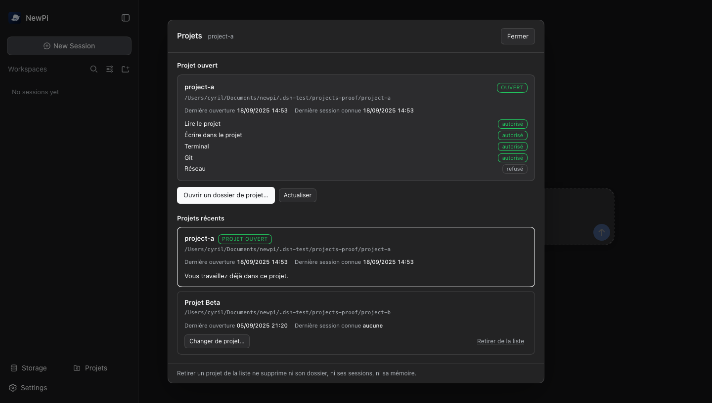
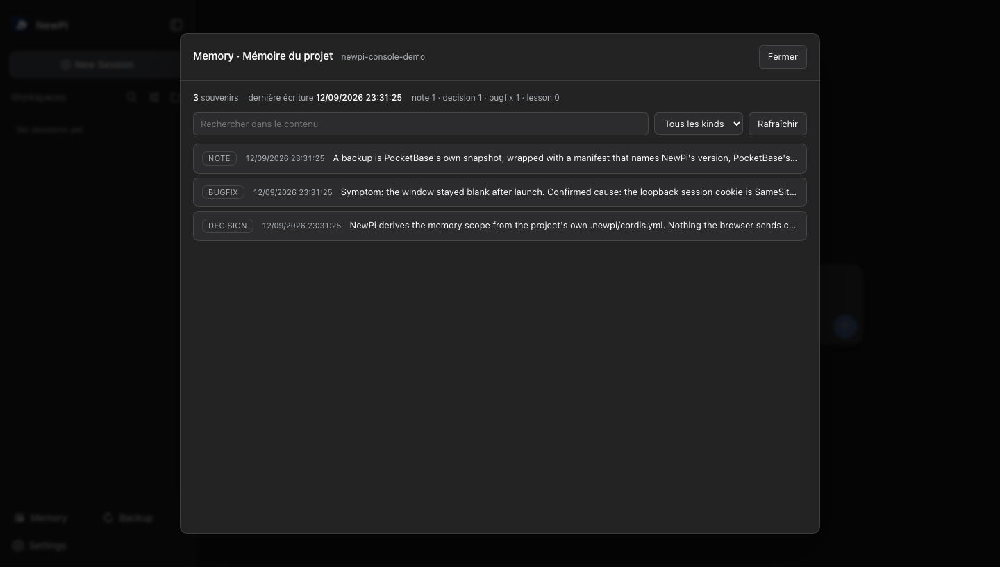
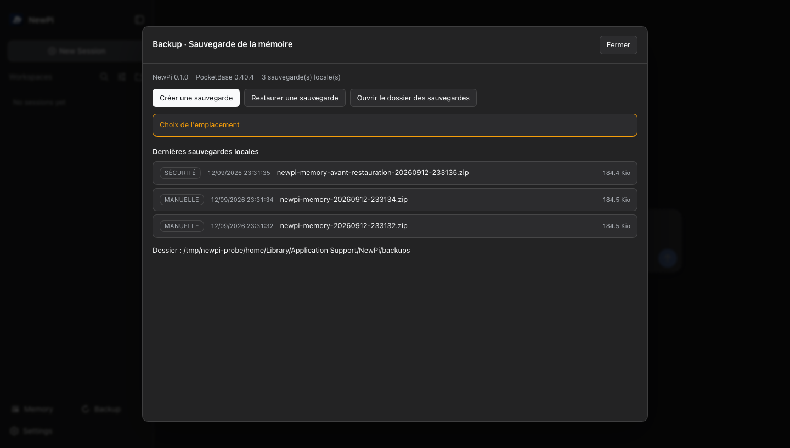
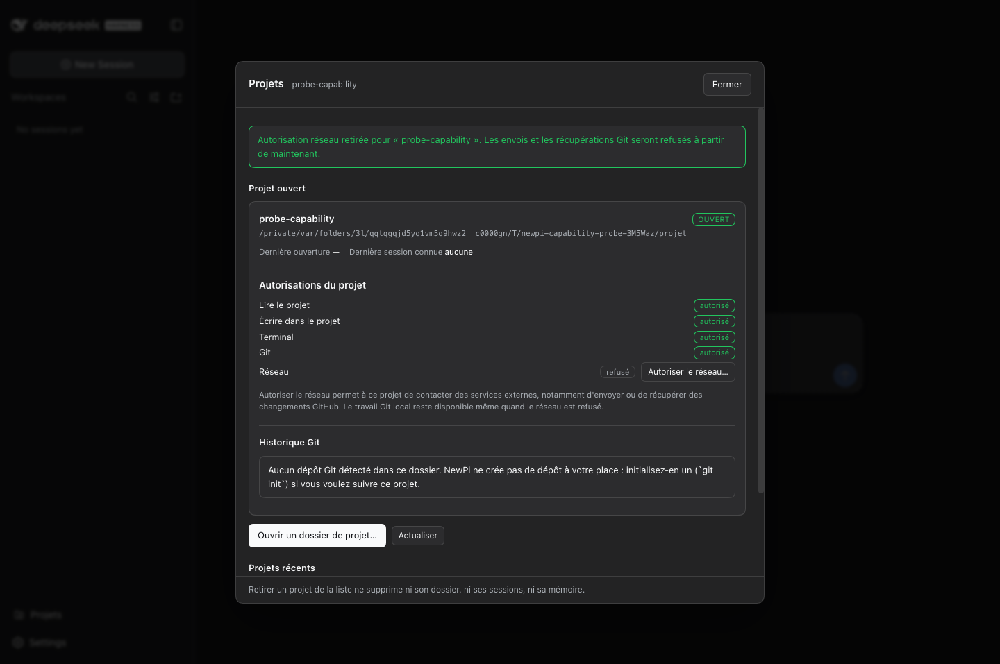
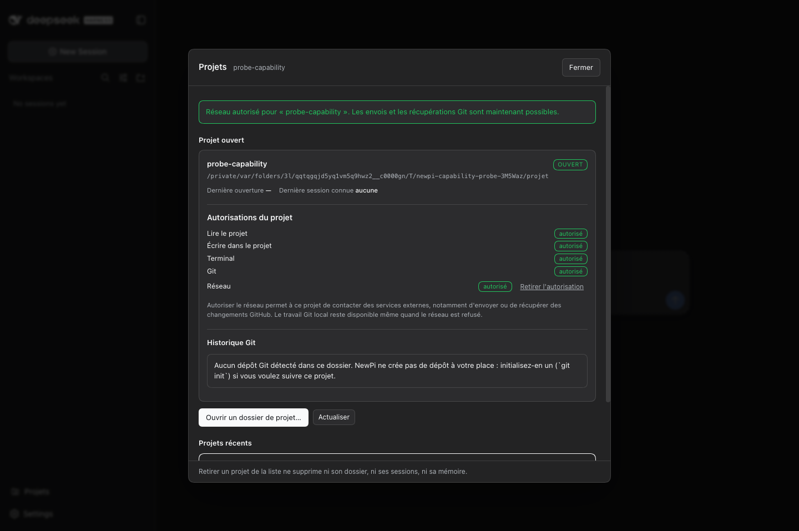
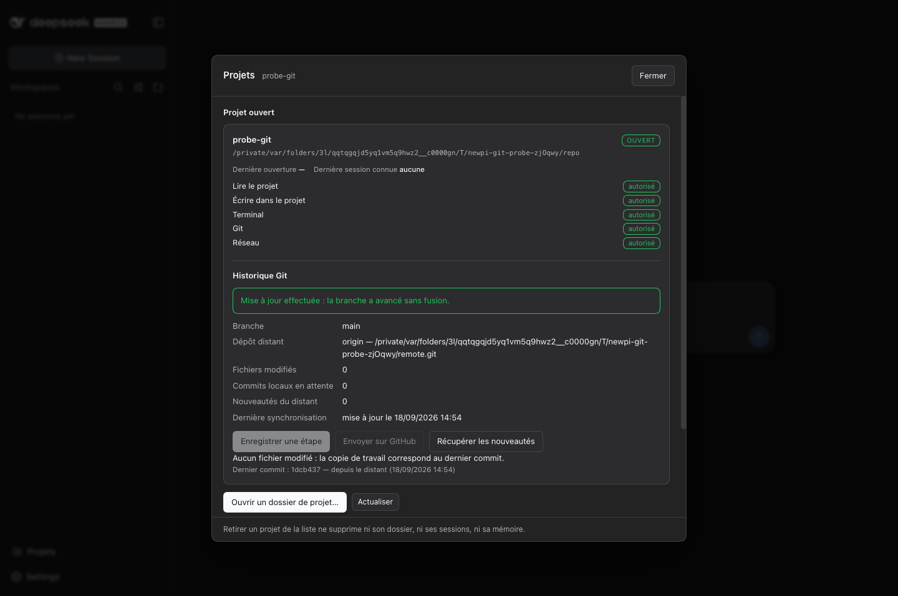

# NewPi

[](https://github.com/cyril-belin/newpi/actions/workflows/tests.yml)
[](LICENSE)
[](#prérequis)

**Une application macOS native qui donne au moteur DeepSeek Harness une
fenêtre, une mémoire de projet durable et des capacités — sans modifier le
moteur.**



## État du projet

NewPi est un projet jeune, publié pour être lu, essayé et repris. Ce tableau dit
ce qui fonctionne aujourd'hui et ce qui manque encore, sans l'arrondir.

| | |
| --- | --- |
| **Ce qui marche** | fenêtre et cycle de vie du moteur ; mémoire durable des projets sur un PocketBase épinglé et vérifié ; sections Memory, Backup, Storage, Projets, Git, Model Router, Context & Cache et Terminal ; apparence NewPi complète (icône, nom, barre latérale) |
| **Ce qui manque** | le runtime n'est pas embarqué : Node et `dsh` doivent être installés sur la machine ; aucun paquet signé ni notarié n'est distribué ; la décision d'embarquer le runtime reste ouverte |
| **Plateforme** | macOS 12 ou plus. L'archive PocketBase épinglée est `darwin_arm64` : Apple Silicon pour l'instant |
| **Preuves** | `pnpm test` exécute la suite Rust puis 257 tests JavaScript ; GitHub Actions rejoue les mêmes suites, plus `rustfmt` et `clippy` |
| **Licence** | MIT, voir [`LICENSE`](LICENSE) |

## Sommaire

- [Ce qu'est NewPi](#ce-quest-newpi)
- [Prérequis](#prérequis)
- [Commandes](#commandes)
- [Comment ça marche](#comment-ça-marche)
- [Ce qui a été vérifié](#ce-qui-a-été-vérifié)
- [Arborescence](#arborescence)
- [Où NewPi trouve le sidecar mémoire](#où-newpi-trouve-le-sidecar-mémoire)
- [Où NewPi trouve le runtime](#où-newpi-trouve-le-runtime)
- [Variables d'environnement](#variables-denvironnement)
- [Limites connues](#limites-connues)
- [Limites de la mémoire en v1](#limites-de-la-mémoire-en-v1)
- [Décision à trancher : embarquer le runtime ou pas](#décision-à-trancher--embarquer-le-runtime-ou-pas)
- [Contribuer](#contribuer)
- [Sécurité](#sécurité)
- [Licence](#licence)

## Ce qu'est NewPi

NewPi est une application macOS native. Elle possède la fenêtre, le cycle de
vie, la mémoire des projets et le lancement du moteur ; l'interface est celle
que ce moteur sert sur la boucle locale.

Le moteur n'est pas modifié : NewPi est une enveloppe Tauri posée autour de
DeepSeek Harness (`dsh`) installé tel quel. Le nom du produit est NewPi, et
c'est lui qui apparaît partout où l'utilisateur regarde — écran de démarrage,
fenêtre, paquet, descriptions du bundle. Le moteur garde son propre nom à
l'intérieur, dans les journaux et dans l'interface qu'il rend, parce que c'est
lui qui tourne.

Tout ce qui porte un nom est renommé, et NewPi ne modifie aucun fichier du
moteur pour y arriver : il monte un troisième petit plugin, `newpi-brand`, qui
possède une prise sur le rendu de `index.html` (`tapIndex`, décrit par le
serveur web comme « l'échappatoire pour le balisage qu'aucune ligne d'injection
structurée n'exprime »).

Deux éléments portent le nom du moteur, et chacun demandait un traitement
différent :

- **Le titre de l'onglet et de la fenêtre.** Le plugin remplace l'élément
  `<title>` dans le HTML servi. C'est ce que la fenêtre affiche avant qu'aucun
  script ne tourne. Mais le client réécrit `document.title` après son démarrage
  — mesuré : le HTML servi disait `NewPi` et `document.title` disait encore le
  nom du moteur quelques secondes plus tard. Le script rejoue donc le renommage,
  puis remplace l'accesseur `title` du document pour qu'une écriture ultérieure
  retombe sur la même valeur. Seul cet accesseur est touché.
- **Le wordmark de la barre latérale.** Le moteur le dessine en SVG : le tracé
  *est* le nom, il n'y a donc aucune chaîne à remplacer. Le client expose en
  revanche `data-slot="sidebar.brand.name"` sur l'élément qui l'entoure. Une
  règle scopée à ce seul slot masque le tracé, et le script ajoute un libellé
  NewPi à côté.
- **Le mark, à gauche du nom.** Même situation dans le slot voisin,
  `sidebar.brand.mark`. NewPi y place sa propre baleine : le script pointe une
  `` vers `/newpi/whale.svg`, une route que le plugin sert lui-même à
  partir de `assets/whale.svg`. Le SVG du dépôt reste donc la seule copie du
  dessin — le plugin le reçoit en configuration, embarqué dans le binaire, et
  le patch de lancement le transporte comme un scalaire YAML (déclaration XML
  retirée, puisqu'un second en-tête dans un document HTML serait une erreur).

  Le mark est dessiné à **28 px** dans une rangée de 28 px, et l'asset est une
  **silhouette** : la baleine et le π, sans le halo flouté ni les traits
  décoratifs de la version « icône ». Ce n'est pas un choix de goût, c'est une
  mesure : à 24 px le halo et les détails internes se confondaient, à 28 px la
  silhouette simplifiée se lit seule. La version détaillée n'existe donc plus
  que dans `assets/logo.svg`, pour l'icône de l'application, où elle est
  rendue à 1024 px et n'a pas cette contrainte.

Mesuré dans un navigateur sur l'application réelle : `document.title` vaut
`NewPi`, les deux tracés du moteur sont en `display: none`, le libellé `NewPi`
est rendu en 46×15, `assets/whale.svg` se charge en 28×28 via
`/newpi/whale.svg`, et la page ne produit aucune erreur. Le mot « HARNESS »
n'apparaît plus nulle part dans le DOM.

### L'icône de l'application

`assets/logo.svg` est la source : `pnpm icon` le rastérise en
`assets/icon-source.png` (1024 px, transparence conservée) et la CLI Tauri en
dérive toutes les tailles, `.icns` compris. Le rastériseur est un vrai moteur
de rendu, pas un redessin : le logo porte deux dégradés, un liseré et un halo
flouté, qu'un traceur maison ne ferait qu'approximer. Il n'est sollicité que
pour cette étape, donc il est cherché plutôt qu'exigé — un dépôt qui ne
régénère pas l'icône n'a rien à installer.

## Prérequis

| Outil | Version | Remarque |
| --- | --- | --- |
| Node.js | 20 ou plus | Lance le moteur NewPi |
| DeepSeek Harness (`dsh`) | disponible | Le moteur, installé globalement, voir plus bas |
| Rust | 1.77 ou plus | Fourni par `rustup` |
| Xcode Command Line Tools | à jour | Fournit l'éditeur de liens macOS |
| pnpm | 9 ou plus | Gère la CLI Tauri |

## Commandes

```sh
pnpm install      # installe la CLI Tauri et copie les modules du harness pour les tests
pnpm dev          # lance NewPi en développement, avec rechargement du Rust
pnpm build        # produit NewPi.app et une image .dmg dans src-tauri/target/release/bundle
pnpm build:app    # produit seulement l'application, sans image disque
pnpm icon         # régénère les icônes depuis assets/icon-source.png
pnpm test         # tests Rust puis tests des plugins
pnpm storage      # occupation disque, et nettoyages reconstructibles seulement
pnpm test:pocketbase   # preuve de bout en bout contre le vrai binaire PocketBase
pnpm test:backup       # sauvegarde, suppression, restauration sur le vrai binaire
pnpm verify:running    # contrôle d'acceptation sur une instance NewPi en cours
pnpm verify:console    # pilote un vrai navigateur sur les sections Memory et Backup
pnpm verify:projects   # pilote un vrai navigateur sur la section Projets
pnpm verify:projects-git  # monte un dépôt et un distant bare isolés, et prouve la zone Git dans l'interface
pnpm verify:projects-capability  # vrai moteur et vraie interface : réseau refusé, autorisé, refusé, sans dépôt ni réseau
```

Si `pnpm install` échoue sur
`EPERM: operation not permitted, chmod .../@deepseek-ai/cordis/bin.js`, le
`node_modules` date d'une version où ces modules étaient des **liens** vers le
harness : pnpm refuse de réparer un lien qui sort du projet, et s'arrête avant
les scripts. Le script de post-installation les copie désormais dans le projet.
Un seul nettoyage suffit :

```sh
rm -rf node_modules/@deepseek-ai && pnpm install
```

`pnpm verify:console` ne démarre rien : il lui faut l'URL que NewPi imprime au
lancement, jeton compris. `pnpm dev` l'affiche en clair, et le script s'en sert
pour ouvrir l'interface dans un Chrome sans fenêtre, cliquer dans les deux
sections, et vérifier ce qu'elles affichent :

```sh
NEWPI_WEB_URL="http://127.0.0.1:7318/?token=…" pnpm verify:console
```

`pnpm dev` compile le binaire Rust, démarre le moteur en local, puis
ouvre la fenêtre native sur l'interface. La toute première compilation
télécharge et construit les dépendances Rust, ce qui prend quelques minutes.
Les suivantes prennent moins d'une minute.

`pnpm build` produit une application signée à la volée, prête à être ouverte
depuis le Finder.

**Pour itérer, préférez `pnpm build:app`.** Construire une image disque a deux
effets de bord qui font apparaître NewPi plusieurs fois devant l'utilisateur :
le lieur fabrique un `.app` temporaire dans `bundle/macos/`, et `hdiutil` monte
une image de travail sous `/Volumes/dmg.XXXX/`. Les deux portent le même
identifiant de bundle que l'application installée, donc Spotlight et Launchpad
les indexent comme autant de NewPi. Sans `--bundles dmg`, ni l'un ni l'autre
n'existe.

`pnpm build` nettoie derrière lui ce qu'il peut : l'exemplaire temporaire est
supprimé et désenregistré. Une entrée de volume démonté, en revanche, ne peut
plus être retirée par `lsregister` — elle disparaît au redémarrage. Le marqueur
`src-tauri/target/.metadata_never_index` évite par ailleurs que Spotlight
indexe le dossier de compilation. Pour la distribuer à d'autres machines, il reste à la signer
avec un certificat Apple et à la notarier.

Le champ `bundle.macOS.signingIdentity` vaut `-` dans `tauri.conf.json`. Cette
valeur force une signature ad hoc sur le bundle entier. Sans elle, seule la
signature du binaire issue de l'éditeur de liens subsiste, et l'ajout de
`Contents/Resources/icon.icns` la rend invalide. Vérifiez la signature avec
`codesign -v` sur `NewPi.app` : elle doit répondre `valid on disk`.

## Comment ça marche

### Le runtime reste un processus à part

Le profil `web` du moteur démarre un serveur HTTP sur `127.0.0.1` et affiche
une ligne de disponibilité qui contient une URL porteuse d'un jeton de
lancement. Le serveur échange ce jeton contre un cookie signé, puis redirige
vers la page propre. Toute l'API et les flux WebSocket sont ensuite
authentifiés par ce cookie.

NewPi exploite ce mécanisme sans rien y changer :

1. Il choisit un port libre, en préférant `7317`. Un port stable garde
   l'origine de la page stable, donc l'interface conserve son stockage local
   entre deux lancements.
2. Il lance `node <entrée dsh> web --no-open --port <port>` dans un groupe de
   processus dédié.
3. Il lit la sortie standard et attend la ligne `dsh web: <url>`.
4. Il ouvre une nouvelle fenêtre dont cette URL est le **premier chargement**,
   puis retire l'écran de démarrage une fois la page rendue.
5. À la fermeture, il envoie `SIGTERM` au groupe de processus, puis `SIGKILL`
   après six secondes. Les shells persistants et les tâches de fond lancés par
   le harness s'arrêtent avec lui.

Pendant le démarrage, la fenêtre affiche un écran local qui montre la
progression, puis le détail de l'erreur si le runtime ne répond pas.

### Pourquoi l'URL doit être le premier chargement

C'est le point le plus facile à casser, et il mérite d'être écrit noir sur
blanc.

Le cookie de session est posé avec `SameSite=Strict`. Si on navigue vers
l'URL porteuse du jeton **depuis l'écran de démarrage local**, cette
navigation part d'une origine différente de `127.0.0.1`. La redirection qui
suit reste alors considérée comme inter site, le navigateur retient le cookie,
et le runtime répond sa page de refus :

```
dsh web authentication required; reopen the URL printed by dsh web.
```

Le symptôme est trompeur : le cookie est bien présent dans le magasin du
navigateur, donc un contrôle naïf conclut à tort que tout va bien, alors que
la fenêtre n'affiche aucune interface.

Une fenêtre créée directement à cette URL n'a pas ce problème, parce que le
chargement n'a pas de page d'origine. C'est exactement ce que fait `dsh web`
quand il ouvre le navigateur par défaut, et c'est pour cette raison que
`open_interface` dans `src-tauri/src/runtime.rs` construit une fenêtre au lieu
de naviguer depuis l'écran de démarrage.

### Aucun serveur distant

Le runtime est local, l'interface est servie par ce runtime local, et aucune
donnée ne transite par un tiers. Le seul trafic réseau est celui que le
harness effectue lui même vers le modèle, exactement comme en ligne de
commande.

### La mémoire durable des projets

Un agent qui repart de zéro à chaque session réapprend les mêmes choses. NewPi
ajoute donc une mémoire par projet : conventions, décisions, bugs résolus avec
leur cause confirmée et leur preuve, et leçons à ne pas refaire. Elle survit
aux sessions, aux mises à jour de NewPi, et ne quitte pas la machine.

Trois pièces, et rien d'autre :

1. **PocketBase en sidecar local.** Le binaire officiel macOS ARM64 est épinglé
   par version et par empreinte SHA-256 (`scripts/pocketbase-pin.mjs`), extrait
   une seule fois dans le répertoire d'état de l'application, puis relancé
   tel quel à chaque démarrage — sans aucun accès réseau. Il écoute sur
   `127.0.0.1` et sur un seul port, choisi et vérifié au lancement.
2. **Le plugin `pocketbase-memory`**, qui porte la connexion, la création, la
   recherche et la suppression des mémoires, et publie le service
   `ctx.pocketbaseMemory`.
3. **Le plugin `memory-tools`**, qui expose ce service au modèle avec trois
   outils : `remember(content, kind)`, `recall(query, kind?, limit?)` et
   `forget(id)`.

Les deux plugins sont écrits dans `plugins/`, compilés dans le binaire, puis
déployés dans le répertoire d'état à chaque lancement. Ils sont montés par un
patch de lancement que NewPi régénère (`launcher.patch.yml`), seul moyen
d'injecter une configuration qui n'existe qu'au moment du démarrage : le port
du sidecar.

#### La boucle de développement : `dev.json`

Compiler les plugins dans le binaire est le bon compromis pour une version
livrée — un paquet qui ne perd aucun fichier — et le mauvais pour qui itère sur
un plugin : une ligne de JavaScript coûterait une reconstruction complète de
l'application. Un fichier optionnel du répertoire d'état rend la boucle d'un
éditeur normal :

```json
{ "pluginsDir": "/Users/you/src/NewPi/plugins", "reload": true }
```

- **`pluginsDir`** : le patch de lancement monte `<pluginsDir>/<plugin>/index.js`
  pour chaque plugin que ce dossier fournit, et le déploiement cesse de posséder
  ces plugins — il ne les réécrit jamais, ne les élague jamais. Le dépôt devient
  la source.
- **`reload`** : un surveillant mesure l'arbre chaque seconde et **redémarre le
  runtime** quand les écritures se sont stabilisées, donc enregistrer suffit.
  C'est désactivé par défaut : redémarrer le runtime termine les sessions qu'il
  sert, et un développeur qui parle aussi à l'agent dans cette fenêtre ne veut
  pas voir une réponse coupée en deux par une sauvegarde.

Sans le fichier, rien ne change : le binaire reste la source. Un `dev.json`
illisible ou pointant vers un dossier absent est signalé et ignoré — il coûte la
boucle, jamais l'application.

#### La console : exécuter sans quitter l'IDE

La section **Console** est le sixième panneau injecté, à côté de Memory, Backup,
Storage et Projets : une ligne dans le pied de la barre latérale, un panneau, et
une commande à la fois exécutée dans le dossier du projet — `git status`,
`pnpm test`, `cargo check`, `pnpm storage`, tout ce qui ne demande pas un
terminal interactif.

Le partage des rôles est le même que partout ailleurs : la page envoie **une
ligne de commande et rien d'autre**, l'hôte décide du dossier (le workspace porté
par la ligne de patch, sinon le projet courant), démarre `/bin/zsh -lc` dans son
**propre groupe de processus**, et streame la sortie en NDJSON — une trame par
morceau de texte, puis une trame `exit` avec le code, le signal, la troncature et
la durée. Les couleurs, les titres OSC et les redessins par retour chariot sont
réduits en texte **sur l'hôte**, donc le panneau est un `<pre>` et non un
émulateur : rien d'échappé n'atteint le document.

Deux détails qui comptent à l'usage : le bouton **Arrêter** annule la requête et
l'hôte tue le groupe entier — un `pnpm dev` lancé par erreur ne survit pas à la
fermeture du panneau ; et une commande qui ne revient pas est arrêtée au bout de
30 minutes, avec la raison affichée.

Ce n'est **pas** un terminal : il n'y a pas de PTY, donc pas de `vim`, pas de
`htop`, pas de contrôle de tâches. C'est le second temps — il coûte une
bibliothèque d'émulation à embarquer, et il ne vaut pas la peine d'imiter à
moitié ce qu'un vrai TTY fait bien.

#### Le cloisonnement entre projets

Il n'y a **qu'une seule collection PocketBase** pour tous les projets. Le
cloisonnement tient à une colonne, `project_id`, et à trois règles :

- `project_id` vient du projet **ouvert**, jamais d'un argument d'outil : les
  trois outils n'exposent que `content`, `kind`, `query`, `limit` et `id`. La
  valeur est épinglée par le `cordis.yml` du projet, puis portée par
  l'enregistrement du Project Model (`memoryNamespace`), que NewPi relit avant
  de démarrer le harness.
- La portée est fixée dans la configuration du service avant que le harness ne
  démarre, et elle est recopiée dans chaque filtre PocketBase — jamais
  appliquée après coup.
- Un identifiant d'un autre projet est donc introuvable *et* indistinguable
  d'un identifiant inexistant : `forget` répond `deleted: false` sans rien
  supprimer.

Pour épingler la portée d'un projet, créez `<projet>/.newpi/cordis.yml` :

```yaml
memory:
  project_id: twin
```

Sans ce fichier, NewPi dérive un identifiant stable du nom du dossier
(`twin`, `mon-projet`) et l'indique dans le journal de lancement. Épinglez la
valeur dès qu'un projet compte : deux dossiers de même nom dans deux chemins
différents partageraient sinon la même mémoire.

**Sans aucun projet ouvert, il n'y a aucune portée.** Le harness a toujours
besoin d'un dossier de travail, donc il démarre dans le dossier personnel — mais
ce dossier est une simple compatibilité de lancement, pas un projet : NewPi ne
lui attribue ni nom, ni namespace, ni mémoire. La section Memory affiche alors
« Aucun projet ouvert » et ne lit ni n'écrit rien. Les souvenirs déjà
enregistrés sous un ancien namespace dérivé (le nom du dossier personnel, par
exemple) restent intacts et ne sont pas migrés en silence.

#### Ce que l'agent doit enregistrer

Les descriptions d'outils portent la règle, parce que c'est le seul endroit que
le modèle lit à coup sûr : enregistrer des **conclusions**, pas de l'activité.
Un bug résolu s'écrit avec ses quatre lignes — symptôme, cause confirmée,
correctif, test ou preuve — et la cause n'est écrite qu'une fois confirmée. Les
pensées de travail, les hypothèses non validées et les reformulations de la
demande en cours n'ont rien à y faire.

#### Emplacement exact des données

```
~/Library/Application Support/NewPi/
├── launcher.patch.yml                     patch de lancement régénéré
├── backups/                               LES SAUVEGARDES DE L'UTILISATEUR
│   └── newpi-memory-20260912-231541.zip   archive + manifeste
├── plugins/                               plugins déployés depuis le binaire
│   ├── pocketbase-memory/                 service, client, environnement
│   ├── memory-tools/                      les trois outils
│   ├── memory-console/                    les deux sections, le pont, le format
│   ├── storage-console/                   la section Storage, le catalogue, la mesure
│   └── node_modules -> ~/.dsh/profiles/node_modules
└── pocketbase/
    ├── pocketbase                         binaire officiel extrait et vérifié
    ├── version                            version épinglée du binaire
    ├── credentials                        superutilisateur local, mode 600
    ├── pb_migrations/
    │   └── 1789230000_create_memories_collection.js
    └── pb_data/                           LA BASE
        ├── data.db                        la collection `memories`
        ├── auxiliary.db
        ├── types.d.ts
        └── backups/                       instantanés du sidecar, transitoires
```

Le dossier `backups/` est un frère de `pocketbase/`, pas un enfant de
`pb_data/` : PocketBase élague le dossier d'instantanés qu'il possède, et une
sauvegarde que l'utilisateur a demandée n'a pas à être supprimée par le sidecar.

Rien de tout cela n'est dans le bundle : une mise à jour de `NewPi.app` remplace
le bundle et laisse ces fichiers intacts. Pour repartir de zéro, supprimez
`pb_data/` ; pour désactiver la mémoire sans rien supprimer, lancez avec
`NEWPI_MEMORY=0`.

#### Les deux sections de l'interface

La mémoire existe pour l'agent, mais elle appartient à l'utilisateur : les deux
sections `Memory` et `Backup` sont là pour qu'il puisse la lire, la filtrer, la
supprimer et la sauvegarder sans passer par un outil.

Elles sont injectées dans l'interface que le runtime sert, exactement comme le
nom du produit : un `<style>` et un `<script>` ajoutés à l'en-tête du document
par `tapIndex`. Aucun fichier du moteur n'est touché, et le script ne remplace
rien : il ajoute des entrées dans le conteneur d'actions du pied de la barre
latérale, et ouvre un panneau par-dessus l'interface. Si ce siège n'existe pas,
des boutons flottants prennent le relais : une section doit être introuvable,
jamais absente.

Le siège est le pied, et **pas** la liste de panneaux du moteur. Celle-ci n'est
rendue qu'à partir du moment où quelque chose s'y enregistre, et le shell y
dessine le composant enregistré *à l'intérieur du glyphe de sa propre ligne* :
une ligne injectée là s'est déjà retrouvée imbriquée dans le bouton d'un autre
plugin, illisible et avalant ses clics. La liste de panneaux est aux composants
que le shell connaît ; un bouton injecté va au pied.

Les sections **Memory** et **Backup** vivent là, décrites ci dessous. C'est la
même mécanique que la console de stockage : un `<style>` et un `<script>`
injectés, et un panneau par dessus l'interface.

L'injection est idempotente : le harness rend ses `tapIndex` au premier
chargement puis de nouveau quand le client navigue en son sein, et un `tap` qui
splice sans regarder met le script de la section dans la page deux fois — ce qui
a produit deux panneaux, dont un dont l'état n'avait jamais été construit.

Ce que fait chaque section :

- **Memory** — le nombre de souvenirs du projet, leur répartition par `kind` et
  la date de la dernière écriture ; une recherche dans le contenu ; un filtre par
  `kind` ; la liste paginée avec `kind`, date, identifiant et aperçu ; l'ouverture
  d'un souvenir pour lire son contenu entier ; sa suppression, uniquement après
  une confirmation explicite ; et un état vide qui dit quoi faire quand le projet
  n'a rien enregistré.
- **Backup** — créer une sauvegarde (l'emplacement est choisi dans un panneau
  d'enregistrement), restaurer une sauvegarde (l'archive est choisie, ses
  métadonnées sont affichées, puis le remplacement est confirmé explicitement),
  ouvrir le dossier des sauvegardes, et la liste des dernières sauvegardes
  locales avec leur date, leur taille et le résumé de leur manifeste.

##### D'où viennent les deux panneaux de fichiers

Le **choix de l'archive** est un `<input type="file">` de la page : c'est le
panneau du système que **la fenêtre de NewPi ouvre elle-même**, attaché à elle,
et l'archive est ensuite lue dans la page puis remise à l'hôte (`backup.upload`,
en base64, dans un dossier de transit `.incoming/`). Ce détour par les octets
est le prix d'un panneau qui appartient à la fenêtre : l'hôte ne reçoit jamais
un chemin que l'utilisateur aurait tapé, et rien ne sort de la machine.

L'**emplacement d'une sauvegarde** ne peut pas venir de la page : le web n'a pas
de panneau d'enregistrement. NewPi le demande donc à macOS par `osascript`, ce
qui est exactement ce que fait le moteur pour son propre sélecteur de dossier —
`dsh-host-directory-picker-native` appelle `osascript -e 'choose folder …'` sur
`darwin`, et reconnaît l'annulation au même code `-128`. La fenêtre de ce
panneau appartient au processus `osascript` et non à NewPi : c'est la
conséquence, assumée, du refus de donner à la page une API Tauri. Une archive
sans panneau reste possible (`pick: false`), et un environnement sans session
graphique le dit au lieu d'échouer en silence.

Les deux captures ci-dessous viennent de l'application en marche, prises par
`pnpm verify:console` sur un Chrome sans fenêtre qui a cliqué dans les deux
sections. La première montre un projet à trois souvenirs ; la seconde, l'écran
de confirmation d'une restauration, avec les métadonnées de l'archive choisie et
l'avertissement qui dit ce que le remplacement emporte.





#### Le pont : une seule route, derrière `/api`

Un seul point d'entrée, `POST /api/newpi.console`, enregistré sur
`ctx.connection.fetch`. La distinction avec `ctx.webServer` est toute
l'histoire de la sécurité, et elle vaut d'être redite parce que les deux
semblent interchangeables et ne le sont pas : une route `webServer` est
dispatchée **avant** toute authentification, alors qu'une route
`connection.fetch` est derrière la même clôture d'origine et le même cookie de
session signé que le reste de `/api`. Un point d'entrée qui peut supprimer un
souvenir n'a pas à être joignable par ce qui sait ouvrir une socket locale.

Dix actions, en deux familles :

| Action | Ce qu'elle fait |
| --- | --- |
| `memory.status` | le nombre de souvenirs, la répartition par `kind`, la dernière écriture |
| `memory.page` | une page de la liste, filtrée par `kind` ou par recherche |
| `memory.read` | le contenu entier d'un souvenir |
| `memory.delete` | la suppression, après confirmation explicite |
| `backup.status` | la liste des archives locales et leurs manifestes |
| `backup.create` | écrire une sauvegarde à un emplacement choisi |
| `backup.upload` | recevoir une archive lue dans la page, en base64 |
| `backup.inspect` | lire le manifeste d'une archive avant de la restaurer |
| `backup.restore` | remplacer la base, après confirmation explicite |
| `backup.reveal` | ouvrir le dossier des sauvegardes dans le Finder |

La portée du projet ne vient pas du navigateur : elle est passée au plugin dans
la ligne du patch de lancement, et le fournisseur la lit depuis le service
plutôt que depuis un argument d'outil. Le validateur refuse toute clé qu'une
action ne déclare pas, donc un `project_id` dans une requête est rejeté avant
qu'une action le voie.

Le mot de passe et l'URL du sidecar ne traversent jamais cette route : ils
voyagent dans l'environnement du runtime, où l'interface ne peut pas les lire.
La console reçoit en revanche les quatre chemins dont ses manifestes ont
besoin — `backupDir`, `snapshotDir`, `dataDir` et les deux versions — parce
qu'aucun n'est un secret.

#### Le format d'une sauvegarde

Une sauvegarde NewPi est une seule archive zip :

```
newpi-memory-20260912-231541.zip
├── manifest.json            ce qu'est cette archive, et ce qu'elle contient
└── pb_data/
    ├── data.db              les souvenirs
    ├── auxiliary.db
    └── types.d.ts
```

Les fichiers de `pb_data/` ne sont pas copiés : ils viennent d'un instantané que
**PocketBase a produit lui-même**, par son API de sauvegarde. C'est toute la
raison pour laquelle ce format peut promettre la cohérence — NewPi ne lit jamais
`data.db` pendant que le serveur écrit, et n'arrête pas le serveur pour autant.
L'instantané du sidecar est supprimé une fois exporté, pour que
`pb_data/backups` ne grossisse pas d'un fichier par sauvegarde.

Le manifeste est ce qui rend une restauration sûre à *proposer* :

```json
{
  "format": "newpi-memory-backup",
  "format_version": 1,
  "created_at": "2026-09-12T21:15:41.211Z",
  "created_by": { "name": "NewPi", "version": "0.1.0" },
  "pocketbase": { "version": "0.40.4" },
  "source": { "project_id": "twin", "collection": "memories" },
  "contents": {
    "entries": ["pb_data/data.db", "pb_data/auxiliary.db", "pb_data/types.d.ts"],
    "bytes": 1003107,
    "sha256": { "pb_data/data.db": "…", "pb_data/auxiliary.db": "…", "pb_data/types.d.ts": "…" }
  },
  "memories": { "total": 4 },
  "reader": { "min_format_version": 1, "max_format_version": 1 }
}
```

Trois refus, chacun avec sa phrase :

- **format inconnu ou illisible** — « ce fichier n'est pas une sauvegarde NewPi » ;
- **format trop récent** — `format_version` au-dessus de ce que cette version lit :
  « sauvegarde trop récente… mettez NewPi à jour pour la restaurer » ;
- **PocketBase trop récent** — la base a été écrite par un PocketBase plus récent
  que celui embarqué : il faut une version de NewPi au moins aussi récente. Une
  sauvegarde écrite par un PocketBase *plus ancien* est acceptée, avec un
  avertissement qui dit que les migrations seront appliquées au redémarrage.

#### Ce que fait une restauration, dans l'ordre

Restaurer remplace la mémoire de **tous** les projets de cette machine. C'est
une transaction avec retour arrière, pas une copie de fichier :

1. l'archive est vérifiée — intégrité zip, manifeste, version, empreintes
   SHA-256, en-tête SQLite — avant que quoi que ce soit soit touché ;
2. une sauvegarde de sécurité de l'état actuel est prise et conservée dans le
   dossier des sauvegardes, sous le nom `…-avant-restauration-….zip` ;
3. les écritures mémoire sont bloquées pour toute la durée de l'opération : un
   `remember` qui arrive pendant ce temps attend, il n'écrit jamais dans une base
   en train d'être remplacée ;
4. l'archive est reconstruite dans la disposition que la restauration de
   PocketBase attend, puis remise au sidecar par sa propre API — qui redémarre
   le serveur autour de la nouvelle base, sur le même port et le même pid ;
5. le résultat est vérifié en **relisant la base** : le nombre de souvenirs est
   comparé à celui du manifeste, et le total du projet est relu. Une
   restauration qui ne correspond pas est annulée, et l'état précédent est remis
   en place depuis la sauvegarde de sécurité.

Un détail mesuré, et la raison d'un quart d'heure de mise au point : après
`POST /api/backups/{clé}/restore`, PocketBase répond `204` environ une seconde
**avant** que la nouvelle base soit en place, et jusque-là il répond encore
l'ancienne. Une restauration vérifiée dès le retour de l'appel vérifiait donc la
mauvaise base. NewPi attend maintenant que le fichier `data.db` change
d'identité, puis que le compte corresponde, avant de conclure.

#### Le dashboard et l'API ne sont pas exposés

Le sidecar est lié à `127.0.0.1` par un littéral, jamais à `0.0.0.0`, et sans
TLS ni redirection. Le dashboard intégré et l'API REST répondent donc sur la
boucle locale uniquement, et la collection refuse tout appel non authentifié
(`403`). Le seul lecteur est le harness, avec un superutilisateur généré sur
cette machine et stocké en mode `0600` ; le mot de passe voyage dans
l'environnement du harness, jamais dans un fichier de configuration.

#### Mem0

Mem0 n'est pas supprimé. Si un profil DSH déclare un paquet Mem0, NewPi écrit
une ligne `disabled: true` dans son patch de lancement, ce qui le débranche sans
toucher aux fichiers ni au profil. Pour revenir en arrière, retirez cette ligne
— ou n'utilisez pas le patch de lancement — et Mem0 se remonte tel quel. Sur une
installation qui ne déclare pas Mem0, aucune ligne n'est écrite : le patch reste
honnête sur ce qu'il fait.

### La section Storage : où est passé le disque

Un `target/` de Tauri, un cache npm et un disque de simulateur ne se signalent
pas. Ils grossissent de quelques gigaoctets par expérimentation, rien ne les fait
jamais tourner, et le premier symptôme est un disque plein sans raison visible.
L'audit qui a produit cette section est dans [`docs/storage-audit.md`](docs/storage-audit.md) :
sur cette machine, les 39 cibles suivies pèsent **107,89 Gio**, dont
**49,11 Gio reconstructibles sans perte**. NewPi lui même — application, base
mémoire, sauvegardes et sessions comprises — tient en moins de 40 Mio.

La section **Storage** est le troisième panneau injecté, à côté de Memory et
Backup, et `pnpm storage` fait la même chose sans fenêtre :

```sh
pnpm storage                        # tableau complet, groupé par portée, + politique
pnpm storage --scope newpi          # seulement le projet et son moteur
pnpm storage --preview npm-cacache  # cible, taille allouée, taille logique, coût
pnpm storage --clean newpi-target --confirm newpi-target
```

Chaque cible du catalogue porte un **rôle** — build jetable, cache
reconstructible, journaux, sessions, mémoire, sauvegardes, état applicatif,
données — et une **classe** :

- **reconstructible** : la sortie d'un compilateur, un cache de paquets, une
  image de bac à sable. La supprimer coûte du temps et de la bande passante,
  jamais une information. Ce sont les seules cibles que la section sait
  supprimer.
- **protégé** : une conversation, un souvenir, une sauvegarde, l'état d'une
  application tierce. Aucun chemin de code ne mène à leur suppression.

Deux chiffres sont affichés par cible, et la distinction compte : la taille
**allouée** (`st_blocks * 512`, ce que le disque dépense) et la taille
**logique** (`st_size`, ce que le fichier annonce). Un fichier creux — une image
de bac à sable, un disque de simulateur — vaut des gigaoctets d'un côté et des
mégaoctets de l'autre ; n'en montrer qu'un est exactement ce qui transforme une
lecture à « 70 Go » en mystère. Un lien symbolique n'est jamais suivi, et un
inode à plusieurs liens n'est compté qu'une fois — sans quoi `target/` se lit à
6,4 Gio au lieu de 3,64 Gio. La mesure a été confrontée à `du -sk` et donne le
même octet.

#### Ce que la section ne peut pas faire

Trois verrous, et le troisième est le vrai.

1. **Le catalogue décide, pas la requête.** Le navigateur ne peut nommer qu'un
   identifiant de cible ; un paramètre qu'une action ne déclare pas est refusé,
   donc aucun chemin ne peut entrer par là.
2. **Le chemin est revérifié sous les racines du lancement.** Le catalogue est
   une donnée : un bogue dedans ne doit pas devenir un `rm -rf $HOME`. La cible
   est résolue puis comparée à `home`, `workspace`, l'état de l'application et
   `$DSH_HOME`, après `path.resolve` — un `..` ou un parent symbolique ne fait
   pas sortir du périmètre.
3. **Supprimer une session, une mémoire ou une sauvegarde n'a pas de fonction.**
   Ce n'est pas une confirmation, c'est un chemin de code absent :
   `runSafeCleanup` refuse un identifiant protégé avant même de résoudre un
   chemin. Une boîte de dialogue est à une frappe de profondeur, et une frappe
   de profondeur s'apprend ; une fonction qui n'existe pas ne se clique pas. Les
   souvenirs se suppriment dans **Memory**, un par un, et les sauvegardes ne se
   suppriment nulle part.

Une suppression reconstructible, elle, demande de **recopier l'identifiant de la
cible** dans un champ, avec la cible et la taille affichées au dessus — dans
l'interface comme dans `pnpm storage --clean … --confirm …`. Le serveur revérifie
cette recopie, puis revérifie que la taille mesurée correspond encore à celle qui
a été montrée : une compilation qui grossit entre l'aperçu et la confirmation
fait échouer la suppression (409) plutôt que d'effacer autre chose que ce qui
était annoncé.

#### Ce qui est reconstructible, et ce que cela coûte

| Mode | Cibles | Coût |
| --- | --- | --- |
| `remove-directory` | `src-tauri/target`, `node_modules`, `.pnpm-store`, DerivedData, symboles iOS, caches pnpm et WebKit | le propriétaire recrée le dossier |
| `clear-contents` | `~/.npm/_cacache`, `~/.npm/_npx`, registre cargo, `~/.cache`, Gradle, pub, Dart, Homebrew, node-gyp, Playwright, SwiftPM, microsandbox | le dossier reste, son contenu se retélécharge |

#### La politique de rétention

Elle est déclarée une fois, dans `RETENTION_POLICY`
(`plugins/storage-console/catalog.js`), et rendue par la section à côté des
chiffres auxquels elle s'applique.

| Rôle | Automatique | Durée | Budget |
| --- | --- | --- | --- |
| build jetable | aucune | — | 8 Gio |
| cache reconstructible | aucune | — | 12 Gio |
| journaux | **rotation** | 7 jours | 50 Mio |
| sessions | jamais | 30 jours, 50 dernières par projet | — |
| mémoire PocketBase | jamais | — | — |
| sauvegardes | jamais | — | — |
| état applicatif | jamais | — | — |

Le budget n'est pas appliqué de force : c'est un seuil au delà duquel la ligne
affiche `⚠ hors budget`. Un budget qui supprime tout seul serait un budget qui
supprime la chose qu'on est en train d'utiliser. Le seul rôle rotatif sans
demande est le journal, parce qu'un journal tronqué ne perd aucun état.

#### Les sauvegardes PocketBase sont hors d'atteinte

`<état>/backups/` est un **frère** de `pocketbase/`, pas un enfant de `pb_data/` :
PocketBase élague le dossier d'instantanés qu'il possède, et une sauvegarde
demandée n'a pas à disparaître avec lui. La section Storage ne supprime rien sous
`backups/` ni sous `pb_data/backups/`, et la section Backup ne fait que créer,
lister, inspecter et restaurer. `pocketbase-memory` est le seul écrivain de la
base ; `storage-console` ne la nomme que pour l'afficher.

### Le Model Router : choisir le modèle sans le coder dans les agents

NewPi n'a pas de registre de providers et n'en veut pas : le harness en a
exactement un, `ctx.llm`, un registre d'adaptateurs avec une API d'appel en
flux, et la couche agent en a exactement une valeur de sélection, le triplet
`{ provider, model, reasoningEffort }` dont un agent construit ses requêtes. Ce
qui manquait était la **politique** : quel triplet une requête reçoit, selon un
mode et un rôle. Elle vit maintenant à un seul endroit, dans le greffon
`model-router`, et un agent n'a plus à connaître le nom d'un provider pour
demander un genre de travail :

```js
const selection = ctx.modelRouter.forRole('coding');
for await (const chunk of ctx.modelRouter.stream('review', request, { sessionId })) { /* … */ }
```

#### Les trois modes

| Mode | Ce qui décide | Changer à chaud |
| --- | --- | --- |
| `manual` | la configuration, et rien d'autre | refusé : c'est la configuration qui décide |
| `switch` | une sélection active, remplaçable | `switchTo({ provider, model })` |
| `auto` | le rôle demandé | `switchTo(..., { role })` pour surcharger un rôle |

Dans les trois modes, la sélection par défaut du processus
(`agentDefaultModel`, le service dont le harness crée ses agents) suit la route
active du mode : un agent qui ne demande aucun rôle démarre donc là où le plan
l'a placé. `auto` expose en plus les routes par rôle via `forRole()`.

#### L'entrée `Adaptive` du sélecteur

Le sélecteur de l'interface liste ce que `ctx.llm` annonce. `auto` était déjà une
politique, mais rien dans l'interface ne permettait de la **choisir** : il
fallait être un agent pour demander un rôle. Le routeur enregistre donc sa propre
route, `newpi-router/adaptive`, affichée `Adaptive` — « Automatically balances
quality and cost ».

Choisir cette entrée, c'est choisir la politique. Le rôle est résolu depuis la
requête elle-même, puis la requête est **réécrite sur la route réelle avant
l'envoi** :

| Signal dans la requête | Rôle |
| --- | --- |
| `purpose: 'compaction'` ou `'session-title'` | `fast` — du volume, pas de la difficulté |
| des schémas d'outils | `coding` |
| rien de tout cela | `default` |

La réécriture est ce qui garde le dossier honnête : le harness journalise
`request.provider` / `request.model` au moment où il assemble le message, donc
c'est le modèle qui a **répondu** qui entre dans l'historique — et dans toute
projection de coût qui price par route —, jamais la pseudo-route. Le `fallback`
du rôle s'applique quand la route primaire échoue avant le premier morceau, et la
réécriture suit : un repli est attribué à la route qui a répondu.

La fenêtre de contexte annoncée pour `Adaptive` est la **plus petite** des routes
du plan, et les modalités leur **intersection** : n'importe lequel des rôles peut
répondre, donc la seule promesse tenable est l'enveloppe commune.

#### La configuration

Elle vit dans le `cordis.yml` du projet, à côté de la portée mémoire, et elle
est lue **avant** le démarrage du harness : un plan invalide est signalé dans la
langue du fichier que l'utilisateur a édité, et le routeur n'est alors pas monté
du tout — perdre un routeur coûte moins qu'une fenêtre.

```yaml
model_router:
  mode: auto
  roles:
    fast:
      provider: deepseek
      model: deepseek-chat
    coding:
      provider: deepseek
      model: deepseek-v4
      reasoning: high
      fallback:
        provider: glm
        model: glm-5.3
    default:
      provider: deepseek
      model: deepseek-chat
  requirements:
    coding:
      tools: true
      max_context: 64000
```

- `mode` est obligatoire, et chaque mode exige ce qui le rend utilisable :
  `manual` exige `manual:`, `switch` exige `active:`, `auto` exige
  `roles.default`.
- Les rôles sont `fast`, `coding`, `reasoning`, `research`, `review` et
  `default`. Un rôle non mappé résout vers `default` ; un rôle hors vocabulaire
  est refusé, parce qu'une faute de frappe ne doit pas se cacher derrière une
  route par défaut.
- Une clé inconnue est refusée, jamais ignorée : un `fallback` mal orthographié
  est une route sans fallback.
- **Aucun credential n'a sa place ici.** Une clé qui ressemble à un secret
  (`api_key`, `token`, `password`…) fait échouer la lecture avec un renvoi vers
  le mécanisme existant, `$DSH_HOME/settings.yaml` et l'environnement. C'est le
  harness qui authentifie ; le plan ne fait que nommer des routes.
- Sans bloc `model_router`, aucun routeur n'est monté et le comportement du
  harness est exactement celui d'avant la fonctionnalité.

#### Le fallback

Un rôle peut déclarer une route de repli. Elle n'est utilisée que sur un échec
d'**indisponibilité** du provider — provider ou modèle temporairement
indisponible, délai dépassé, quota ou limite de débit, erreur réseau, statut
5xx — et seulement **avant** qu'un seul morceau ne soit parvenu à l'appelant :
redémarrer après une sortie partielle la dupliquerait. Un échec fonctionnel ou
logique du modèle (`INVALID_ARGS`, `CONTEXT_WINDOW_EXCEEDED`, `AUTH`,
`EMPTY_RESPONSE`, abandon) ne déclenche jamais de repli : changer de provider ne
le corrigerait pas et masquerait la cause réelle. Le classement est explicite et
échoue en fermé : un code inconnu ne replie pas. Chaque repli est journalisé
avec sa raison.

#### Le bail de modèle

Toute opération qui passe par `stream()` prend d'abord un **bail** : sa route
est figée au moment où elle commence. Un `switchTo()`, un `setMode()` ou une
surcharge de rôle ne s'appliquent donc qu'aux opérations suivantes. Un bail est
**critique** par défaut, et un `switchTo()` est alors refusé tant qu'il court —
c'est ce qui empêche une étape atomique d'être annoncée sur un modèle et
terminée sur un autre. `switchTo(..., { force: true })` est l'échappatoire
explicite, et il ne change toujours pas la route du bail en cours.

#### Les capacités

`requirements` déclare ce qu'une tâche exige, et une route peut déclarer ce
qu'elle sait faire. Ce que l'adaptateur publie (`contextWindow`,
`inputModalities`, efforts de raisonnement) est dérivé automatiquement ; `tools`
n'est pas publié par le harness et doit donc être déclaré. Une exigence est un
plancher : seul `true` en énonce un, et `false` veut dire « pas nécessaire », pas
« interdit ». Une capacité **inconnue** n'est pas un échec — un adaptateur qui
n'annonce rien ne doit pas rendre toutes les routes incapables — mais elle est
rapportée. `auto` écarte une route dont l'incapacité est *prouvée* et choisit le
repli s'il convient ; si aucune route ne convient, la résolution refuse au lieu
d'exécuter silencieusement un modèle inadapté.

#### Observabilité

Chaque appel — routé par le service ou non — produit une entrée de journal qui
porte le mode actif, le rôle demandé, le provider et le modèle utilisés, le
repli éventuel et sa raison, et les identifiants de session et d'opération. Le
greffon s'accroche à `llm/stream`, le seul point qui voit aussi les requêtes
qu'il n'a pas construites, pour les **observer sans les rediriger**. Une entrée
ne peut pas porter de prompt ni de credential : sa forme est fixée par
`RECORD_KEYS`, et tout diagnostic qui y entre est d'abord nettoyé (`sk-…`,
`Bearer …`, `clé = valeur`, longues suites opaques). L'API est prête pour une UI
sans en imposer une : `describe()` rend le mode, la route active, chaque rôle,
les surcharges et les baux en cours ; `onCall()` et `recentCalls()` donnent le
flux d'appels.

### Le Context & Cache Manager : nommer le contexte, mesurer le cache, ne pas le simuler

Un prompt n'est pas un bloc homogène : un long préfixe stable (les règles du
harness, la persona, les instructions du projet) part à chaque étape et ne bouge
presque jamais, un résumé de handoff repose sur l'historique compacté et ne
change qu'à une compaction, et la queue — le message courant, les derniers
résultats d'outil — change à chaque appel. Le cache de prompt d'un provider ne
peut être réutilisé que sur la partie qui n'a pas bougé. Le greffon
`context-cache-manager` répond donc à « qu'est ce qui a changé depuis le dernier
appel », puis à « le provider l'a t il facturé comme un hit ».

#### Les cinq couches

| Couche | Stabilité | Source dans le harness |
| --- | --- | --- |
| `core` | stable | les sections du prompt système assemblé |
| `project` | semi stable | les contributions de contexte d'exécution |
| `handoff` | semi stable | le résumé de la dernière compaction terminée |
| `session` | dynamique | l'historique avant le message courant |
| `live` | dynamique | le message courant et les résultats d'outil qui le suivent |

Chaque couche est réduite à un **digest**, un compte et les noms qui l'ont
composée. Aucune couche ne conserve le texte du prompt : c'est ce qui permet de
journaliser la télémétrie sans qu'un secret du projet n'y entre jamais.

#### Deux versions

- `contextVersion` (`ctx_v1`, `ctx_v2`…) nomme le **préfixe cacheable** :
  `core` + `project` + `handoff`. Il n'avance que si le digest de ce préfixe
  change. Deux appels de même version sont deux appels dont le cache provider
  peut être réutilisé ; un changement de version est le moment où un **miss est
  attendu** plutôt que surprenant. `session` et `live` en sont exclus : ils
  changent à chaque appel, et une version qui change à chaque appel ne nomme
  rien.
- `handoffVersion` (`handoff_v1`, `handoff_v2`…) nomme le **handoff figé**. Il
  avance une seule fois par compaction terminée, et pas avant : entre deux
  compactions, l'enregistrement de handoff est immuable. Une compaction en
  échec ne valide rien — le handoff précédent reste courant.

#### La télémétrie par appel

Chaque appel produit une entrée qui porte le provider, le modèle, l'effort, la
session, l'opération, l'objet de l'appel (`purpose`), les deux versions, l'issue,
l'usage rapporté, les faits de cache dérivés, et le digest des cinq couches. Sa
forme est fixée par `RECORD_KEYS` : une entrée ne peut pas gagner un champ qui
porterait un message ou un credential, et tout diagnostic est nettoyé avant
d'entrer (`sk-…`, `Bearer …`, `clé = valeur`, longues suites opaques).

#### Pas de faux cache

Le manager ne stocke aucun prompt, ne sert aucun préfixe, n'estime aucun hit.
Les seuls nombres qu'il rapporte sont des compteurs émis par un adaptateur, ou
de l'arithmétique sur ces compteurs. Le harness normalise déjà chaque provider
en compteurs **disjoints** : `inputTokens` (non caché), `cacheReadTokens`
(servi depuis le cache), `cacheWriteTokens` (écrit). Le manager en dérive
`promptTokens = input + read + write`, `missTokens = input` et
`hitRatio = read / promptTokens`.

Un provider qui n'expose aucune métrique de cache produit `available: false` et
une raison — une **absence de donnée, jamais une erreur**, et jamais un zéro
fabriqué. Les adaptateurs livrés qui exposent des compteurs : DeepSeek
(`prompt_cache_hit_tokens` / `prompt_tokens_details.cached_tokens`, sans champ
d'écriture) et pi ai (`cacheRead`, `cacheWrite`, omis quand nuls). Tout autre
adaptateur, ou un adaptateur simulé, reste simplement « inconnu ».

#### L'API

`ctx.contextCache` expose l'état courant (`current()`, `snapshots()`), les
versions (`versions()`), le journal (`recentCalls()`, `onCall()`), les
statistiques (`cacheStats()`), la température par route (`temperature()`,
`temperatures()`), et un instantané complet pour une UI (`describe()`). Pour le
Model Router, `hintsFor(provider, model)` et `allHints()` rendent tout ce qu'une
politique consciente du cache aurait besoin de savoir : température
`hot`/`warm`/`cold`/`unknown`, statistiques, et versions du dernier appel sur la
route. La température est volontairement prudente et sensible au temps : le
cache d'un provider expire, donc un ratio mesuré il y a une heure ne rend pas le
prochain appel `hot`.

**Rien de tout cela ne décide d'une route.** La politique AUTO du Model Router
est intacte : les données sont préparées et exposées, et aucun appel ne les lit.
Le manager se monte par une ligne vide du patch de lancement, sans dépendance
injectée : un déploiement qui ne configure rien se comporte exactement comme
avant la fonctionnalité.

### Le Project Model : un projet nommé une fois, lu par tout le reste

Le harness est lancé avec un seul dossier de travail, et rien en lui ne porte
la notion de « projet » : un dossier est un workspace, une session a un `cwd`,
et c'est tout. Le greffon `project-model` ajoute la pièce qui manquait — le
**projet courant**, unique par construction — et les quelques garde-fous qu'un
futur éditeur ou un terminal consultera.

Il ne réinvente pas un workspace. `ctx.workspaceRegistry` reste le registre
durable de ce qu'est un dossier ; un projet est ce workspace *plus* ses
métadonnées, et le service crée l'enregistrement de workspace plutôt que de le
remplacer. Il ne fait pas non plus une seconde mémoire : `memoryNamespace` est
le même `project_id` que celui avec lequel le backend a été configuré, donc un
projet nomme un seul espace.

#### Le registre

Un petit document JSON sous le répertoire d'état, `projects.json` : les projets
récents (20 au maximum), lequel est courant, et pour chacun la racine
canonique, les réglages, les sessions associées (200 au maximum), le namespace
mémoire, l'état de handoff et un petit état d'interface (`lastSessionId`,
`lastTab`, `recentFiles`). Chaque écriture passe par un fichier temporaire
renommé, comme le patch de lancement. La lecture est **totale** : un document
corrompu coûte la liste des récents, jamais le lancement, et l'avertissement
est journalisé.

#### Les cinq capacités, et la porte

Un projet déclare ce qu'il autorise : `readWorkspace`, `writeWorkspace`,
`terminal`, `git` — actives par défaut, parce qu'un outil de code local qui ne
pourrait pas lire son propre dossier ne servirait à rien — et `network`,
**désactivée** par défaut parce que c'est la seule qui ajoute de la portée. Un
`assertCapability()` refuse en `403` une capacité non accordée, et
`withCapability(cap, body)` fait de la vérification et du travail un seul
appel : la porte ne peut pas être oubliée entre les deux.

**La zone Git applique une double autorisation.** La capacité `git` couvre ce
qui se passe sur la machine — détecter le dépôt, lire le statut, montrer un
diff, créer un commit local. Toute action qui quitte la machine — `fetch`,
`push`, et la mise à jour en avance rapide déclenchée après un `fetch` — exige
`network` **en plus**. Un projet dont `git` est actif mais `network` refusé
garde donc tout le travail local, et la zone désactive clairement « Envoyer sur
GitHub » et « Récupérer les nouveautés » en disant que le réseau du projet doit
être autorisé. Le refus a son propre code, `GIT_NETWORK_DENIED` (`403`), pour
que la page n'ait pas à interpréter une erreur de capacité générique.

#### Autoriser le réseau depuis l'interface

La fiche du projet ouvert porte une zone **Autorisations du projet** : les cinq
capacités y sont écrites en mots, et un contrôle n'apparaît que pour celles que
le **serveur** déclare modifiables. Dans cette version, une seule l'est :
`network`. « Autoriser le réseau…» ouvre une confirmation qui nomme le projet et
dit ce que l'autorisation ouvre (contacter des services externes, notamment
envoyer ou récupérer des changements GitHub) ; « Retirer l'autorisation » en
ouvre une autre, qui dit que le travail Git local reste disponible et qu'une
opération déjà en cours n'est pas interrompue. La zone Git est relue dans la
foulée, donc ses deux boutons distants suivent le changement immédiatement.

Rien de tout cela n'est décidé par la page. L'action est
`project.capability.set { name, allowed, confirm }`, sur
`POST /api/newpi.project` : elle ne déclare ni identifiant, ni chemin, ni projet,
donc elle porte toujours sur le projet **ouvert**, et elle exige
**`confirm: true`**. Le nom reçu est comparé à `MODIFIABLE_CAPABILITIES` côté
modèle (`['network']`) ; un nom connu mais gardé par le serveur — `git` par
exemple — est refusé en `PROJECT_CAPABILITY_READONLY` (`403`), et un nom inconnu
en `PROJECT_UNKNOWN_CAPABILITY`. La vérification, le type booléen, la
confirmation et la garde d'opération passent **avant** toute écriture : un
`confirm` absent, `false` ou d'un autre type est refusé en `PROJECT_INVALID_ARGS`
(`400`), et un refus laisse `projects.json` identique octet pour octet. La
confirmation n'est donc pas une politesse de l'interface : le Project Model la
vérifie lui-même, et une page qui oublierait de la demander ne pourrait pas
accorder une capacité. Le démarrage, l'ouverture d'un projet et la reprise après
une erreur ne touchent jamais une capacité ; le seul écrivain du modèle est
`updateCapability()`, appelé par cette action et par rien d'autre.

Deux autres garde-fous vont avec :

- `resolve(target)` ramène tout chemin à l'intérieur de la racine, par la même
  fonction que les autres consommateurs — un `..` ne fait pas sortir du
  périmètre, il est refusé.
- Une opération enregistrée auprès du service **bloque un changement de
  projet** (`PROJECT_BUSY`, `409`) : c'est ce qui empêche une écriture longue
  d'atterrir dans le projet que l'utilisateur vient d'ouvrir. `force: true`
  est l'échappatoire, et c'est un paramètre qu'un appelant doit écrire.

#### Les sessions et le handoff

Une session dont le `cwd` est dans le projet lui est associée, et la décision
est recopiée vers `ctx.workspaceRegistry` — au mieux, parce qu'un workspace qui
refuse une session est dans son droit et que son refus ne doit pas faire
échouer l'association. Une compaction terminée est lue depuis le registre de
versions du Context & Cache Manager, qui est le seul objet à savoir quand un
handoff a été validé : le projet enregistre ce que le manager rapporte plutôt
que d'en déduire une seconde réponse.

Chaque couture est optionnelle (`workspaceRegistry`, `sessions`,
`contextCache`, `connection`) et atteinte par `ctx.get` : un déploiement sans
elles obtient quand même un projet, parce que « la fonctionnalité est absente »
doit rester distinguable de « NewPi n'a pas démarré ».

#### L'endpoint, et ce que le navigateur ne peut pas faire

`POST /api/newpi.project`, derrière la même authentification que le reste de
`/api`, expose vingt actions : le projet courant, la liste des récents,
ouvrir un projet connu, en créer un pour un dossier existant, fermer,
**retirer un projet de la liste des récents**, les sessions, les capacités,
**changer la capacité réseau du projet ouvert**, lire ou fusionner l'état
d'interface, **lire les opérations en cours**, **demander un dossier au
sélecteur natif de l'hôte**, **demander à NewPi de redémarrer**, et les **six
actions Git** (statut, diff, commit local, `fetch`, envoi, mise à jour en avance
rapide). La barrière de paramètres est la même que celle des deux consoles : le
navigateur ne peut **pas** fixer librement les capacités d'un projet, son
namespace mémoire, son handoff, ni l'état d'un autre projet — ces clés ne sont
pas déclarées, donc elles sont refusées avant qu'une action les voie. La seule
capacité qu'il peut changer est celle que le serveur ouvre, `network`, et
`project.capability.set` ne déclare ni `id`, ni `rootPath`, ni `projectId` : elle
porte toujours sur le projet ouvert. Une action Git ne déclare ni force, ni
refspec, ni nom de distant : ses seuls paramètres sont un message et une liste de
fichiers. Le redémarrage et le changement de capacité exigent en plus un
`confirm: true` explicite, vérifié par le serveur : le Project Model refuse un
`confirm` absent, `false` ou d'un autre type avant d'écrire quoi que ce soit. Le
sélecteur de dossier s'exécute sur l'hôte, dans `osascript` : la page ne reçoit
jamais de capacité Tauri.

Le service et l'endpoint sont complets et testés, et la section **Projets** les
lit désormais : le projet ouvert avec son dossier, ses cinq capacités et sa zone
**Autorisations du projet**, les projets récents avec leur dernière ouverture et
leur dernière session connue, un bouton qui ouvre le sélecteur de dossier natif,
et un retrait de la liste qui ne supprime rien sur le disque. Changer de projet
enregistre le choix comme dernier projet ; le moteur, lui, garde son dossier de
lancement jusqu'au redémarrage de NewPi, et l'interface le dit au lieu de le
cacher.

La capture ci-dessous vient d'une application isolée en marche, prise par
`pnpm verify:projects` sur un Chrome sans fenêtre : `HOME` temporaire,
`NEWPI_MEMORY=0`, et un registre de deux projets. On y voit le projet ouvert
avec ses cinq capacités (`Git` autorisé, `Réseau` refusé par défaut), les
récents avec leurs dates, et le retrait discret qui ne supprime rien.


Les deux captures suivantes viennent de `pnpm verify:projects-capability`, qui
monte un vrai moteur et une vraie interface autour d'un projet **sans dépôt Git
et sans réseau** : l'état refusé par défaut, puis l'état autorisé après la
confirmation. Ce sont les deux moments du passage refusé, autorisé, refusé que
la sonde prouve de bout en bout.





### L'historique Git, dans la fiche du projet ouvert

Le projet ouvert peut être un dépôt Git : la même section **Projets** ajoute
une zone **Historique Git** sous ses capacités, sans seconde barre latérale,
sans second registre et sans second endpoint. Tout passe par
`ctx.projectModel` et par les six actions que son endpoint expose :
`project.git.status`, `project.git.diff`, `project.git.commit`,
`project.git.fetch`, `project.git.push` et `project.git.pull`.

Ce que la zone montre, dans les mots d'une personne : le dépôt est-il détecté,
sur quelle branche, avec quel distant, quels fichiers ont changé (et de combien
de lignes), combien de commits locaux attendent, ce que le distant a en plus, et
la dernière synchronisation que NewPi a lui-même faite. Chaque fichier ouvre son
diff lisible à la demande. Trois boutons suffisent : **Enregistrer une étape**
(choisir des fichiers, écrire un message, créer un commit local), **Envoyer sur
GitHub** (pousser les commits locaux vers le distant déjà configuré) et
**Récupérer les nouveautés** (lire le distant, puis proposer une mise à jour
seulement si elle est en avance rapide).

Rien n'est forcé, et la liste de ce qui est impossible est la garantie :

- **la racine doit être exacte.** Toute lecture commence par
  `git rev-parse --show-toplevel` ; si la réponse n'est pas *exactement* le
  dossier du projet — parce que le projet vit dans un dépôt plus grand —, rien
  n'est lu et rien n'est exécuté ;
- **les dépôts imbriqués et les sous-modules sont refusés** pour cette première
  version, avec une phrase qui le dit, plutôt qu'opérés au hasard ;
- **le local d'abord, le réseau ensuite.** `git` autorise le statut, le diff et
  le commit ; `fetch`, `push` et la mise à jour demandent en plus `network`. Si
  le réseau est refusé, la zone reste utile en local et désactive ses deux
  boutons distants avec une phrase qui dit quoi autoriser ;
- **aucune commande destructive n'existe.** Les commandes sont une liste
  d'arguments (`execFile`, jamais un shell), et le lanceur refuse `reset`,
  `clean`, `checkout`, `rebase`, `stash`, `branch`, toute mutation de remote et
  `--force` sous toutes ses formes. La seule mise à jour est
  `git merge --ff-only` : elle avance, ou elle échoue sans toucher à la copie
  locale. Le `push` n'a aucune option de force, et un envoi refusé par le
  distant reste refusé ;
- **aucune écriture sans clic.** La lecture tourne avec
  `GIT_OPTIONAL_LOCKS=0` : même le rafraîchissement de l'index n'est pas écrit ;
- **une opération Git tient la garde.** `commit`, `fetch`, `push` et `pull`
  s'enregistrent comme opération du Project Model : changer de projet, en
  retirer un ou demander un redémarrage est refusé (`PROJECT_BUSY`) tant qu'elle
  court ;
- **aucun secret n'est stocké.** Git s'authentifie avec ce que la machine a
  déjà — agent SSH, trousseau macOS, Git Credential Manager — et le prompt
  interactif est désactivé : une authentification manquante est une phrase, pas
  une attente. Les diagnostics sont expurgés avant d'être journalisés ou
  affichés.

Une divergence, un conflit, un dépôt absent, un `index.lock`, une fusion en
cours ou une branche détachée s'arrêtent avec une explication et l'action
humaine à faire ; aucun de ces cas n'est résolu automatiquement.

La capture ci-dessous vient de `pnpm verify:projects-git`, qui construit un
dépôt et un distant **bare** isolés, monte le vrai moteur avec les deux greffons
du projet, et pilote un Chrome sans fenêtre : l'état est affiché, un diff
s'ouvre, une étape est enregistrée, envoyée au distant, puis une nouveauté du
distant est appliquée en avance rapide.



### La page distante ne reçoit aucun accès à Tauri

L'écran de démarrage est du contenu local et il est le seul à disposer d'une
capacité Tauri, limitée au bus d'évènements. L'interface, chargée
depuis `http://127.0.0.1`, ne reçoit aucune API Tauri. Cette séparation est
volontaire : cette page reste une page web ordinaire, et la surface
d'attaque côté application native reste vide.

## Ce qui a été vérifié

Chaque point ci dessous a été mesuré sur cette machine, pas seulement compilé.

| Point | Preuve |
| --- | --- |
| Compilation sans avertissement | `cargo build` et `cargo test` propres |
| Arrêt du groupe de processus | test Rust `shutdown_stops_the_whole_process_group` |
| Lecture de la ligne de disponibilité | trois tests, dont le suffixe réseau local |
| Fenêtre native | application enregistrée `type="Foreground"` avec ses processus WebKit |
| Interface réellement rendue | une sonde injectée dans la fenêtre a rapporté le titre de la page et le texte de l'écran d'accueil, sur le binaire comme sur le bundle |
| Échange de jeton | redirection `303` puis cookie signé, et `401` sans cookie |
| Cache du piège inter site | l'interface reste authentifiée au lancement comme à la relance, et quatre connexions s'établissent vers le runtime, signe que les ressources du SPA sont chargées |
| Arrêt propre, chemin Tauri | `quit` sur le bundle, puis aucun processus restant et port libéré |
| Arrêt propre, chemin signal | `SIGTERM` sur l'application, puis aucun processus restant |
| Commandes documentées | `pnpm dev` et `pnpm build` exécutées, `.app` et `.dmg` produits |
| Sidecar PocketBase en boucle locale | `pnpm verify:running` : un seul socket, `127.0.0.1`, jamais `0.0.0.0` |
| Migration appliquée pour de vrai | `pnpm test:pocketbase` : colonnes et deux index lus dans `data.db` après démarrage du binaire officiel |
| Création, rappel, suppression | les deux suites : aller-retour complet sur PocketBase réel et sur un faux en mémoire |
| Persistance après redémarrage | arrêt puis relance du sidecar sur le même `pb_data`, la mémoire est toujours là |
| Cloisonnement entre projets | `alpha` ne voit pas et ne supprime pas la mémoire de `beta`, en test unitaire comme sur la base réelle |
| Aucun `project_id` dans les outils | un test lit les schémas des trois outils et refuse ce champ ; un appel qui le passerait est rejeté par le schéma |
| Schémas d'outils conformes | les définitions passent les assertions du registre du harness lui-même, importées par les tests |
| Patch de lancement accepté | le YAML produit par Rust est relu par `js-yaml` (le lecteur du harness) et le harness démarre avec |
| Mémoire non bloquante au démarrage | un sidecar injoignable est signalé et l'interface s'ouvre quand même |
| Icône de l'application | `assets/logo.svg` → `icon-source.png` 1024 px transparent → `.icns` ; `codesign -v` reste valide |
| Mark de la barre latérale | mesuré : tracé du moteur en `display:none`, `/newpi/whale.svg` servi en `image/svg+xml` et chargé en 28×28, rangée de 28 px, aucune erreur |
| Taille du mark choisie sur mesure | les deux variantes rendues côte à côte à 24 et 28 px ; la silhouette simplifiée à 28 px est la seule qui reste lisible |
| Sections injectées dans le bon siège | mesuré sur l'application en marche : cette version du moteur déclare `sidebar.panellist` mais ne la rend pas tant que personne ne s'y enregistre ; les deux entrées atterrissent donc dans `sidebar.footer.action`, et le repli est couvert par un test |
| Bouton principal lisible | mesuré dans le thème sombre : `--dsw-alias-brand-primary` y vaut `#f9fafb`, donc du texte blanc sur ce fond disparaissait ; le bouton prend maintenant la paire du thème, remplissage plus `label-primary-foreground` |
| Interface renommée | mesuré dans un navigateur sur l'application réelle : `document.title` = `NewPi` (le client le réécrivait, l'accesseur est verrouillé), tracé du wordmark en `display: none` (0×0), libellé `NewPi` rendu (46×15), aucune erreur de page, « HARNESS » absent du DOM |
| Sections Memory et Backup | `pnpm verify:console` sur une application en marche : deux entrées dans la barre latérale, le panneau Memory lit le projet (`newpi-console-demo`, 3 souvenirs, `note 1 · decision 1 · bugfix 1 · lesson 0`), le panneau Backup affiche l'écran de confirmation — capture dans `console-memory.png` et `console-backup.png` |
| Section Projets | `pnpm verify:projects` sur une application isolée (`HOME` temporaire, `NEWPI_MEMORY=0`) : l'entrée « Projets » est dans la barre latérale, le panneau lit le projet ouvert et son dossier, les cinq capacités sont en mots (`Git autorisé`, `Réseau refusé`), les récents affichent leur dernière ouverture et leur dernière session connue, la confirmation du changement nomme le projet actuel et le projet cible, et aucune des chaînes internes (`memoryNamespace`, `workspaceId`, `handoff`, `detached`) n'est sur la page — capture dans `console-projects.png` |
| Dernier projet repris au lancement | deux lancements de la même application isolée : `projects.json` porte `currentId`, et la ligne `[newpi/memory] projet=…` du second lancement nomme le projet choisi, sans `NEWPI_WORKSPACE`. La racine par défaut serait le `HOME` temporaire, donc la valeur vient bien du registre |
| Projet non supprimé par un retrait | `tests/project-model.test.mjs` : après `project.forget`, le dossier et le `projects.json` des autres projets sont intacts (`stat`), le projet ouvert garde ses sessions et son namespace |
| Redémarrage refusé sans bundle | `tests/project-model.test.mjs` : `project.restart` répond `PROJECT_RESTART_UNAVAILABLE` (`409`) quand NewPi n'est pas une application, et `PROJECT_INVALID_ARGS` sans `confirm: true` ; rien n'est demandé à l'hôte |
| Restauration pilotée par l'interface | `pnpm verify:console --restore-round-trip true` : l'archive est supprimée, puis choisie par le `<input type="file">` de la fenêtre — le fichier lui est remis par l'API du navigateur, comme le ferait un clic — l'écran de métadonnées s'affiche, le bouton « Restaurer et remplacer la mémoire locale » est cliqué, et le souvenir supprimé revient avec son identifiant |
| Panneau d'enregistrement | `pnpm verify:console --probe-save-panel true` : la demande reste en suspens pendant que le panneau est ouvert (c'est ce qu'un panneau modal montre à la page), le processus du sélecteur est mis fin, et la réponse est `{cancelled: true}` sans erreur. Deux exécutions ont été jusqu'au bout : le panneau a été accepté et a produit une archive au manifeste valide |
| Script du panneau compilé | test unitaire : `osacompile` compile le script généré, sans afficher de panneau — c'est ce test qui a trouvé l'instruction collée qui cassait le bouton |
| L'interface ne peut pas nommer un projet | `pnpm verify:console` : un `project_id` envoyé par la page est refusé (`400`, `unknown parameter`) ; l'action inconnue répond `404` |
| L'interface ne reçoit aucun secret | `pnpm verify:console` : 404 619 octets de DOM sans mot de passe, sans identifiant, sans nom de variable d'environnement et sans adresse du sidecar |
| L'endpoint n'est pas ouvert | `pnpm verify:console` : le même appel sans le cookie de session répond `401`, et l'interface elle-même répond `401` |
| Sauvegarde, suppression, restauration | `pnpm test:backup` sur le vrai binaire : deux projets isolés, une sauvegarde, une suppression, une restauration — la mémoire supprimée revient avec son identifiant, l'autre projet est intact, `sqlite3` le confirme dans `data.db` |
| Format d'archive vérifié à la main | `pnpm test:backup` : l'archive contient exactement `manifest.json`, `pb_data/data.db`, `pb_data/auxiliary.db`, `pb_data/types.d.ts`, et le manifeste imprimé porte les deux versions, la date et les empreintes |
| Archive corrompue refusée | test unitaire : une archive dont `data.db` a été réécrit est refusée sur l'empreinte, et la base est remise dans son état précédent depuis la sauvegarde de sécurité |
| Écritures bloquées pendant une restauration | test unitaire : un `remember` lancé pendant la restauration reste en attente, n'apparaît pas dans la base restaurée, et aboutit après |
| **Tour réel avec le modèle** | `node scripts/acceptance-memory-e2e.mjs <log>` : une session DeepSeek réelle appelle `remember`, puis `recall`, puis `forget` — voir le détail ci dessous |
| La racine est la seule atteignable | test unitaire, sur un vrai dossier temporaire : `..`, un chemin absolu, `~`, un lien symbolique vers `/etc` et un lien vers un dossier voisin sont refusés en `403`, et rien n'est écrit dehors |
| Un lien symbolique interne reste un lien | test unitaire : écrire à travers `alias/link.txt` modifie la cible et laisse le lien en place |
| Ni périphérique ni FIFO | test unitaire : un FIFO créé dans le workspace est refusé (`FILE_NOT_REGULAR`) au lieu de bloquer la lecture, et n'est pas listé |
| Les dossiers lourds ne sont pas listés | test unitaire : `.git`, `node_modules`, `target`, `dist`, `.cache` et `.DS_Store` sont absents de l'arbre, `.env` y est |
| Binaire et trop gros | test unitaire : un PNG et un fichier de 3 Mio reviennent en `kind: binary` et `kind: too-large`, sans contenu — et le fichier à la limite exacte reste lisible |
| L'écriture ne tronque jamais | test unitaire : soixante lectures concurrentes pendant l'écriture de 400 Kio ne voient que l'ancienne version ou la nouvelle, jamais un préfixe, et aucun temporaire ne survit |
| Conflit, et remplacement explicite | test unitaire : une écriture avec un jeton périmé est refusée en `409` sans toucher au fichier, `force: true` remplace, et une écriture sans jeton ne peut pas écraser un fichier jamais lu |
| La modification de l'agent est vue | test unitaire : `stat` change de jeton après une écriture faite directement sur le disque, et disparaît quand le fichier est supprimé |
| La mesure disque égale `du` | sur `src-tauri/target` : `du -sk` lit 3 913 084 928 octets, la mesure du greffon lit 3 913 084 928 octets — les liens durs comptés une fois, les liens symboliques jamais suivis |
| Nettoyage sûr dans un répertoire isolé | un faux dossier personnel construit pour le test : 12 Mio de build jetable et 4 Mio de cache npm partent, la session, `data.db` et la sauvegarde ZIP restent, et le cache vidé garde sa place |
| Sessions, mémoire et sauvegardes refusées | `pnpm storage --clean <id> --confirm <id>` sur `dsh-sessions`, `newpi-pb-data` et `newpi-backups` répond `STORAGE_GUARDED_TARGET` et sort en 2 — le refus vient du catalogue, avant toute résolution de chemin, et les fichiers sont toujours là après |
| Confirmation non recopiée refusée | `--clean newpi-target` sans `--confirm` affiche la cible et la taille allouée puis refuse ; le serveur exige la recopie de l'identifiant **et** une taille encore conforme, sinon `409` |
| La section Storage, sur un vrai moteur | un vrai `dsh web` et un vrai PocketBase dans un monde isolé — 16 sessions réelles et une copie de `pb_data` — avec le patch de lancement produit par le générateur Rust : 18/18, dont `storage.status` à 39 cibles, le nettoyage d'un build à 3 002 368 octets récupérés, `memory.status` qui relit les 5 souvenirs du projet `cyril`, et les 16 sessions intactes empreinte par empreinte |
| L'instance en cours n'est pas touchée | NewPi et son sidecar tournaient pendant tout l'audit et n'ont pas été redémarrés ; les 5 souvenirs sont présents et inchangés après coup. L'empreinte du **fichier** `data.db` a en revanche changé — PocketBase écrit son propre compte rendu sur la connexion vivante, authentification superutilisateur comprise — ce qui est mesuré et dit plutôt que passé sous silence |
| Project Model : registre et garde-fous | `tests/project-model.test.mjs` : le projet de lancement est ouvert, lié à son workspace et rendu courant ; `create`, `open` et `close` déplacent un seul projet courant en gardant les récents ; une opération en vol refuse un changement (`PROJECT_BUSY`, `409`) et `force` est le seul passage ; `resolve` refuse un chemin hors racine ; un dossier déplacé met la racine à jour sans créer un second projet |
| Project Model : endpoint et coutures optionnelles | le même test : `/api/newpi.project` est enregistré et refuse un paramètre non déclaré ; un déploiement sans workspace registry ni session store obtient quand même un projet ; un `projects.json` corrompu coûte les récents et non le lancement |
| Git : la racine exacte, et ce qui est refusé | `tests/project-git.test.mjs`, sur de vrais dépôts : un projet qui vit dans un dépôt plus grand est refusé (`GIT_ROOT_MISMATCH`), un dossier sans dépôt est répondu sans erreur, un dépôt imbriqué (`GIT_NESTED_REPOSITORY`) et un sous-module (`GIT_SUBMODULE_UNSUPPORTED`) sont refusés avec une phrase, et un chemin hors racine ne quitte jamais le périmètre |
| Git : statut, diff, commit des fichiers choisis | le même test : `git status --porcelain=v2` est parses en branche, distant, compteurs et fichiers avec leurs `+n/−m` ; un diff d'index et un diff de fichier non suivi sont lisibles ; un commit ne contient que les fichiers choisis, garde les autres changements indexés hors du commit, et refuse une liste ou un message vide avant que Git ne voie quoi que ce soit |
| Git : push normal autorisé, push forcé impossible | le même test : un commit local atteint le distant bare ; une divergence fait refuser l'envoi (`GIT_PUSH_REJECTED`, `409`) et laisse le distant intact ; `assertSafeGitArgs` refuse `reset`, `clean`, `checkout`, `rebase`, `branch -D`, toute mutation de remote, `push --force`/`-f`/`--force-with-lease`/`--delete` et `merge` sans `--ff-only`, et un audit enregistre chaque argv réellement exécuté |
| Git : fetch, avance rapide, divergence et conflit | le même test : `fetch` lit le distant sans toucher la copie locale ; `pull` applique une avance rapide sans commit de fusion ; une divergence est refusée et `HEAD` comme le fichier restent identiques ; un conflit et un `MERGE_HEAD` refusent `commit`, `fetch`, `push` et `pull` ; une copie sale bloque la mise à jour (`GIT_WORKTREE_DIRTY`) |
| Git : la garde tient pendant une opération | le même test, avec un lanceur Git réellement lent : pendant `model.gitStatus()`, `open`, `forget` et `restart` répondent `PROJECT_BUSY` (`409`) et le projet ne bouge pas ; `restart` consulte donc la garde, ce qu'il ne faisait pas |
| Git : l'endpoint et la capacité | le même test : les six actions passent par `/api/newpi.project`, et toute clé non déclarée (`force`, `remote`, `refspec`, `branch`, `hard`) est refusée (`PROJECT_INVALID_ARGS`, `400`) avant d'atteindre une action |
| Git : la double autorisation | le même test : avec `git` refusé et `network` accordé, les six actions répondent `403` `PROJECT_CAPABILITY_DENIED` (le réseau n'ouvre rien en local) ; avec `git` seul (le défaut), statut, diff et commit passent, et `fetch`, `push` et `pull` répondent `403` `GIT_NETWORK_DENIED` sans que Git soit lancé (le distant n'a pas bougé) ; avec `git` + `network`, `fetch` atteint Git et échoue pour sa propre raison (`GIT_NO_REMOTE`) ; le statut porte `networkAllowed`, et la zone désactive ses deux boutons distants en l'expliquant |
| Zone Git : preuve dans l'interface | `pnpm verify:projects-git` : dépôt et distant bare isolés, vrai `dsh web` monté avec les deux greffons du projet, Chrome sans fenêtre — la zone « Historique Git » s'affiche dans la fiche du projet ouvert avec la branche et le distant, un diff s'ouvre, « Enregistrer une étape » crée un vrai commit local (vérifié par `git log`), « Envoyer sur GitHub » l'envoie au distant (vérifié dans le bare), puis « Récupérer les nouveautés » propose et applique une avance rapide (vérifié : 3 commits, pas de fusion). Le projet de test porte `network: true` sur son enregistrement, puisque `git` seul ne suffit plus au distant — capture dans `console-projects-git.png` |
| Capacité réseau : refusée, autorisée, refusée | `pnpm verify:projects-capability` : vrai `dsh web` monté avec les deux greffons du projet dans un monde isolé, **sans aucun dépôt Git et sans aucun réseau** — la zone « Autorisations du projet » affiche `Réseau refusé` et le bouton « Autoriser le réseau… » ; la confirmation nomme le projet, son dossier, GitHub et la promesse de ne pas interrompre une opération en cours ; « Annuler » ne fait aucune écriture ; la confirmation acceptée écrit `network: true` dans `projects.json` et le fait que la zone Git lit (`networkAllowed`) passe à `true` ; « Retirer l'autorisation » confirmée ramène l'enregistrement et le fait à `false`. L'interface ne joint `confirm: true` que depuis le bouton de confirmation, et le modèle le revérifie. Captures dans `console-projects-network-refused.png` et `console-projects-network-allowed.png` |
| Capacités : une seule porte, et rien d'écrit sans elle | `tests/project-model.test.mjs` : `MODIFIABLE_CAPABILITIES` vaut `['network']` ; `git` est refusé en `PROJECT_CAPABILITY_READONLY` (`403`), un nom inconnu en `PROJECT_UNKNOWN_CAPABILITY`, un non booléen et toute clé non déclarée (`id`, `rootPath`, `capabilities`) en `PROJECT_INVALID_ARGS` ; `confirm` absent, `false`, `'yes'`, `1` ou `null` est refusé en `PROJECT_INVALID_ARGS` (`400`) sans écrire, et `confirm: true` est le seul chemin qui réussit ; **chaque** refus laisse `projects.json` identique octet pour octet (vérifié dans la boucle) ; une opération critique refuse en `PROJECT_BUSY` sans écrire ; sans projet ouvert, la réponse est `PROJECT_NONE_OPEN` (`409`) et aucun projet n'est créé ; ouvrir ou démarrer un projet ne change jamais une capacité, y compris un `network: true` déjà enregistré |
| Capacité : le distant Git suit le changement | `tests/project-git.test.mjs` : `project.git.fetch` répond `403` `GIT_NETWORK_DENIED` avant, `project.capability.set {name:'network',allowed:true}` fait passer `networkAllowed` à `true`, le `fetch` suivant atteint réellement Git sur le distant bare isolé, le retrait ramène `networkAllowed` à `false`, les trois actions distantes sont refusées de nouveau, et un commit local continue de fonctionner pendant tout ce temps |

### Le tour réel, en détail

Le 12 septembre 2026, sur cette machine, une session DeepSeek réelle a exécuté
le cycle complet. Le script pilote le harness par son propre RPC, puis lit la
preuve à trois endroits indépendants : le journal de session durable, la base
PocketBase, et les résultats d'outils que le modèle a reçus.

```
projet de test   newpi-acceptance-e2e   (isolé, épinglé dans .newpi/cordis.yml)
marqueur         acceptance-1789241773374
session          session-5390cacb-e28f-495d-87d1-e6dd86c54d38

le modèle a émis     remember, puis recall
tool/call            remember  seq=17   content="acceptance-… : le projet de test …"
tool/call            recall    seq=22   query="acceptance-…"
aucun appel          ne portait de project_id — le schéma l'interdit
ligne en base        1 seule : dzlyz8cv063euhm · kind=note · sous newpi-acceptance-e2e
résultat du recall   "[note] dzlyz8cv063euhm · 2026-09-12 …\nacceptance-… : …"
méta du recall       {"count":1}   (la projection déclarée par l'outil)
tool/call            forget    seq=35   id=dzlyz8cv063euhm
résultat du forget   "Forgot dzlyz8cv063euhm."
base après          0 ligne dans le projet, 0 ligne dans toute la base
```

Trois choses sont prouvées par cette sortie, et aucune ne l'était par les tests
précédents :

1. **Les trois outils sont réellement offerts au modèle.** Ce n'est pas une
   déduction sur le registre : le modèle les a appelés, et ses appels sont
   enregistrés dans le journal de session.
2. **Le cloisonnement tient côté modèle.** Aucun appel ne portait de portée ;
   l'identifiant vient du `cordis.yml` du projet, et la base ne contenait qu'une
   ligne, sous ce seul projet.
3. **L'aller-retour est réel.** Le `recall` a renvoyé la mémoire que le
   `remember` venait d'écrire, avec son identifiant et son horodatage, et
   `forget` l'a supprimée — la base est revenue à zéro ligne, vérifié par une
   requête SQLite directe après l'arrêt de l'application.

Le script nettoie derrière lui : la mémoire est supprimée par l'agent avec
`forget`, et la session de test comme l'espace de travail temporaire sont
retirés. La preuve brute est écrite dans
`$TMPDIR/newpi-acceptance-evidence.json`.

## Arborescence

```
newpi/
├── README.md                 ce document : de quoi décider si NewPi vous convient
├── CONTRIBUTING.md           mise en route, portail de tests, invariants
├── SECURITY.md               le canal privé de signalement des failles
├── AGENTS.md                 la carte du dépôt, pour un agent comme pour une personne
├── LICENSE                   MIT
├── package.json              scripts pnpm et CLI Tauri
├── ui/index.html             écran de démarrage local
├── pb_migrations/            migrations PocketBase versionnées
├── plugins/
│   ├── pocketbase-memory/    service mémoire : connexion, création, recherche, suppression
│   ├── memory-tools/         provider : remember, recall, forget
│   ├── memory-console/       les sections Memory et Backup, le pont, le format d'archive
│   ├── storage-console/      la section Storage : catalogue, mesure, nettoyage sûr
│   │   ├── catalog.js        la politique : rôle, classe et budget de chaque cible
│   │   ├── scan.js           mesure bornée, liens non suivis, liens durs comptés une fois
│   │   ├── cleanup.js        les trois verrous, et le refus des cibles protégées
│   │   └── ui.js             la section injectée
│   ├── model-router/         la politique de routage : mode, rôles, repli, bail
│   │   ├── plan.js           le contrat de configuration, validé des deux côtés
│   │   ├── routing.js        les décisions pures : repli, capacités, nettoyage
│   │   └── index.js          le service `ctx.modelRouter`, les baux, le journal
│   ├── context-cache-manager/  les couches, les versions, la télémétrie du cache
│   │   ├── context.js        le modèle de couches et le registre des versions
│   │   ├── cache.js          l'arithmétique du cache, la température, le nettoyage
│   │   └── index.js          le service `ctx.contextCache` et ses trois coutures
│   ├── project-model/        le projet courant, son registre, ses garde-fous et Git
│   │   ├── model.js          capacités, chemins, garde d'opération, handoff
│   │   ├── store.js          `projects.json`, écriture atomique, lecture tolérante
│   │   ├── platform.js       le sélecteur de dossier natif et la relance propre
│   │   ├── git.js            la couture Git : racine exacte, argv structuré, six verbes
│   │   └── index.js          le service `ctx.projectModel` et son endpoint
│   ├── projects-console/     la section Projets, qui lit le modèle ci-dessus
│   │   ├── ui.js             la section injectée : barre latérale, panneau, choix, autorisations, zone Git
│   │   └── index.js          le service `ctx.projectsConsole`, sans endpoint
│   ├── terminal-console/     la console : une commande à la fois, sortie en flux NDJSON
│   ├── newpi-brand/          le nom du produit dans le titre de l'interface
│   └── session-queue-guard/  un message envoyé pendant un tour attend la fin de ce tour
├── docs/
│   ├── features.md           l'inventaire des fonctionnalités, en table
│   └── storage-audit.md      l'audit disque : inventaire, causes, rétention
├── assets/
│   ├── logo.svg              le logo de l'application (source de l'icône)
│   ├── whale.svg             le mark de la barre latérale
│   └── icon-source.png       produit par `pnpm icon`, ignoré par git
├── scripts/
│   ├── make-icon.mjs         rastérise logo.svg en icône source
│   ├── pocketbase-pin.mjs    version et empreintes du sidecar
│   ├── fetch-pocketbase.mjs  télécharge et vérifie l'archive épinglée
│   ├── link-harness-modules.mjs  copie les modules du harness pour les tests
│   ├── verify-running-newpi.mjs  contrôle d'acceptation sur une instance vivante
│   ├── probe-console-ui.mjs  pilote un vrai navigateur sur les deux sections
│   ├── probe-projects-ui.mjs  pilote un vrai navigateur sur la section Projets
│   ├── probe-projects-git-ui.mjs  monte un dépôt et un distant bare, et prouve la zone Git
│   ├── probe-projects-capability-ui.mjs  prouve le réseau refusé, autorisé, refusé, sans dépôt ni réseau
│   ├── probe-scope-ui.mjs    prouve la portée du lancement : projet ouvert, changement, aucun projet
│   └── storage.mjs           la commande `pnpm storage` : tableau, aperçu, nettoyage
├── tests/
│   ├── memory.test.mjs       comportement des plugins mémoire
│   ├── memory-console.test.mjs  console et sauvegarde, sur le faux PocketBase
│   ├── storage-console.test.mjs catalogue, mesure, nettoyage, refus, section injectée
│   ├── model-router.test.mjs modes, rôles, baux, repli, capacités, refus, journal
│   ├── context-cache.test.mjs couches, versions, handoffs, cache, absences, API
│   ├── project-model.test.mjs registre, garde, capacités, sessions, endpoint
│   ├── project-git.test.mjs   Git sur de vrais dépôts et un distant bare
│   ├── projects-console.test.mjs section Projets : injection, DOM, zone Git, autorisations
│   ├── session-queue-guard.test.mjs  la file d'attente des messages, et son unique couture
│   ├── fake-pocketbase.mjs   faux PocketBase, filtres et sauvegardes compris
│   ├── pocketbase-live.mjs   preuve contre le vrai binaire
│   └── backup-live.mjs       sauvegarde, suppression, restauration, vérification
├── vendor/pocketbase/        archive officielle épinglée
├── assets/icon-source.png    icône 1024 px, produite par le script
└── src-tauri/
    ├── Cargo.toml
    ├── build.rs
    ├── tauri.conf.json       fenêtre, bundle, identifiant
    ├── capabilities/         permissions, contenu local uniquement
    ├── icons/                icônes dérivées par la CLI Tauri
    └── src/
        ├── main.rs           cycle de vie de l'application
        ├── runtime.rs        résolution, lancement et arrêt du runtime et du sidecar
        ├── memory.rs         disposition sur disque, portée du projet, patch de lancement
        ├── models.rs         lecture et validation du plan de routage
        ├── pocketbase.rs     provisionnement, démarrage et vérification du sidecar
        ├── patch.rs          génération du patch de lancement
        ├── assets.rs         plugins et migration embarqués dans le binaire
        └── process.rs        groupes de processus et arrêt propre
```

## Où NewPi trouve le sidecar mémoire

L'archive PocketBase est épinglée dans `scripts/pocketbase-pin.mjs` (version,
nom d'archive, empreinte SHA-256, taille) et versionnée dans
`vendor/pocketbase/`. `pnpm install`, `pnpm dev` et `pnpm build` vérifient sa
présence ; `node scripts/fetch-pocketbase.mjs` la télécharge si elle manque, en
la confrontant au `checksums.txt` publié par la release puis à l'empreinte
épinglée. Au démarrage, NewPi la reprend depuis le binaire, revérifie les deux
empreintes, extrait l'exécutable dans son répertoire d'état et note la version
à côté — une extraction réussie n'est donc jamais refaite, et une archive
modifiée arrête le lancement au lieu de s'exécuter.

Pour changer de version : `node scripts/fetch-pocketbase.mjs --version vX.Y.Z`
affiche les valeurs à reporter dans l'épinglage, puis relancez le script sans
option. Le numéro n'est jamais modifié à la main dans deux fichiers à la fois.

## Où NewPi trouve le runtime

La résolution essaie dans cet ordre et s'arrête à la première réussite :

1. un runtime embarqué dans l'application, sous
   `Contents/Resources/runtime/node/bin/node` et
   `Contents/Resources/runtime/dsh/lib/bin.js` ;
2. la variable `NEWPI_NODE` pour l'interpréteur et `NEWPI_DSH_ENTRY` pour le
   point d'entrée ;
3. `NEWPI_DSH_BIN`, puis la commande `dsh` trouvée sur le `PATH`.

L'étape 1 est déjà implémentée mais aucun runtime n'est encore embarqué : voir
la section suivante. La recherche sur le `PATH` complète le `PATH` reçu avec
`~/.local/bin`, `~/bin`, `~/.cargo/bin`, `/usr/local/bin` et
`/opt/homebrew/bin`, parce qu'une application ouverte depuis le Finder
n'hérite pas de l'environnement du terminal.

## Variables d'environnement

| Variable | Effet |
| --- | --- |
| `NEWPI_NODE` | Interpréteur Node à utiliser |
| `NEWPI_DSH_ENTRY` | Point d'entrée du harness, par exemple `.../dsh/lib/bin.js` |
| `NEWPI_DSH_BIN` | Commande `dsh` à résoudre, au lieu de la chercher sur le `PATH` |
| `NEWPI_WORKSPACE` | Racine de travail du harness. Par défaut le dernier projet choisi, sinon le dossier personnel |
| `NEWPI_MEMORY` | `0`, `false`, `no` ou `off` désactivent la mémoire pour ce lancement |
| `NEWPI_POCKETBASE` | Chemin d'un binaire PocketBase à utiliser au lieu de l'archive épinglée |
| `DSH_HOME` | Lue par le harness lui même, comme en ligne de commande |

NewPi pose aussi quatre variables pour les plugins mémoire, lues une fois au
chargement : `DSH_MEMORY_URL`, `DSH_MEMORY_IDENTITY`, `DSH_MEMORY_PASSWORD` et
`DSH_MEMORY_PROJECT_ID`. Elles sont renseignées par NewPi et n'ont pas à être
définies à la main ; un lancement manuel du harness peut les fournir pour
joindre un PocketBase déjà démarré.

La console, elle, ne lit aucune variable : ses quatre réglages — `backupDir`,
`snapshotDir`, `dataDir` et les deux versions — voyagent dans la ligne du patch
de lancement, parce qu'aucun n'est un secret. Le mot de passe et l'URL du
sidecar continuent de passer par l'environnement, où l'interface ne peut pas les
lire.

## Limites connues

- La racine de travail suit le **dernier projet choisi** : `NEWPI_WORKSPACE`
  quand il est défini, sinon le projet courant de `projects.json`, sinon le
  dossier personnel — qui n'est alors **pas** un projet et ne porte aucune
  portée mémoire. Le choix fait dans la section Projets est donc repris au
  lancement suivant ; en revanche, le moteur garde son dossier tant qu'il tourne,
  parce qu'un processus a un seul dossier de travail et une seule base mémoire.
  C'est pourquoi l'interface annonce le redémarrage au lieu de le laisser
  deviner.
- Le bouton « Redémarrer NewPi » n'existe que lorsque NewPi tourne depuis un
  `.app`. Sous `pnpm dev` (un binaire nu), la section le dit et demande de
  quitter puis rouvrir l'application à la main. La relance utilise `osascript`
  et l'identifiant de bundle : macOS peut demander une autorisation
  d'automatisation la première fois.
- La section Projets **n'ouvre pas** la dernière session d'un projet dans le
  moteur. Le registre garde la date de la dernière session connue et l'affiche,
  mais une section injectée n'a aucune couture vers la navigation du client ;
  le moteur montre donc son propre écran, avec les sessions du projet dans la
  barre latérale. Un vrai plugin client serait nécessaire pour aller plus loin,
  et ce n'est pas ce lot.
- La zone **Historique Git** est volontairement étroite. Elle ne crée pas de
  dépôt, ne configure ni ne modifie aucun remote, ne gère ni les dépôts
  imbriqués ni les sous-modules, et ne fait ni fusion, ni rebase, ni changement
  de branche, ni remisage : elle lit l'état, montre un diff, crée un commit
  local des fichiers choisis, `fetch`, `push` sans force et `merge --ff-only`.
  « GitHub » désigne le distant déjà configuré dans le dépôt ; l'authentification
  est celle de Git sur la machine, et NewPi ne stocke aucun identifiant. La
  détection d'un dépôt imbriqué est bornée (profondeur 6, 20 000 entrées,
  dossiers de dépendances ignorés) : c'est une limite de la vérification, pas
  une promesse.
- **Une seule capacité est réglable depuis l'interface.** La zone
  « Autorisations du projet » accorde et retire `network`, sur le projet ouvert
  seulement, après une confirmation explicite, et la zone Git suit le
  changement. Les quatre autres capacités (`readWorkspace`, `writeWorkspace`,
  `terminal`, `git`) restent décidées par le serveur : la liste des capacités
  modifiables est la sienne (`MODIFIABLE_CAPABILITIES`), et l'ouvrir à d'autres
  noms demandera une décision, pas un bouton. Un projet livré tel quel ne voit
  donc que la moitié locale de la zone Git tant que personne n'autorise le
  réseau.
- Il n'y a plus d'éditeur de fichiers. Les fichiers du projet se consultent
  dans l'arbre de la colonne de droite du moteur et s'ouvrent dans son aperçu,
  en lecture seule. La racine, la lecture, l'écriture et les conflits décrits
  plus haut ont été retirés avec lui ; un futur éditeur repartira de ce
  document et des capacités du Project Model plutôt que du code retiré.
- Une seule fenêtre et un seul runtime à la fois. Rien n'empêche de lancer
  deux copies de NewPi, chacune avec son propre port.
- Le paquet n'est pas signé ni notarié, donc Gatekeeper le refusera sur une
  autre machine que celle qui l'a produit.
- Le catalogue de la section Storage est une table écrite à la main. Une
  nouvelle cache — un outil de plus, un gestionnaire de paquets de plus — est
  invisible tant que personne ne l'y ajoute ; l'audit le dit et ne prétend pas
  le contraire. Les entrées génériques du projet (`target`, `node_modules`) se
  découvrent seules, puisque leurs chemins viennent de l'espace de travail.
- La mesure est bornée : une cible énorme peut être rapportée
  `mesure partielle` plutôt que de faire attendre le panneau indéfiniment.
  Le chiffre affiché est alors un minorant, jamais une estimation.
- `NEWPI_MEMORY=0` ne monte que les greffons sans base de données — le nom du
  produit, le Project Model et sa section Projets (Git compris), la section
  Storage et le gestionnaire de contexte et de cache. Les sections Memory et
  Backup disparaissent avec le sidecar, ce qui est le sens de la variable.
- La rotation des journaux et la conservation des sessions sont des règles
  affichées, pas des programmes. Aucun composant de NewPi ne supprime une
  session ou un journal ; la politique existe pour être lue à côté du chiffre.

## Limites de la mémoire en v1

Ce qui est volontairement absent, et pourquoi :

- **Recherche textuelle seulement.** `recall` fait un `LIKE` insensible à la
  casse sur le contenu, du plus récent au plus ancien, plafonné à 8 résultats
  par défaut et 50 au maximum. Pas de vecteurs, pas d'embedding, pas de rappel
  sémantique, aucun appel externe : une requête qui ne partage pas un mot avec
  la mémoire ne la trouvera pas. C'est le compromis assumé de cette version.
- **Pas de mise à jour en place.** Une mémoire se corrige en écrivant la
  nouvelle puis en supprimant l'ancienne avec `forget`. Rien ne modifie une
  ligne existante, ce qui garde `created_at` honnête.
- **Pas de déduplication.** Deux `remember` identiques créent deux lignes. Le
  modèle est censé rappeler avant d'écrire ; rien ne l'y force.
- **Le cloisonnement est par chaîne, pas par utilisateur.** Quiconque peut
  écrire dans le `cordis.yml` d'un projet peut lire la mémoire de ce projet.
  C'est la bonne maille pour une machine personnelle, pas pour un service
  multi-utilisateurs.
- **Une seule machine.** Le `pb_data` n'est ni synchronisé ni sauvegardé par
  un tiers. Les sauvegardes NewPi sont des fichiers locaux : les copier ailleurs
  est à la charge de l'utilisateur. Supprimer le dossier efface la mémoire de
  tous les projets.
- **La portée dérivée peut collisionner.** Deux projets de même nom de dossier
  partagent la même mémoire tant que `memory.project_id` n'est pas épinglé.
- **Le sidecar n'est pas surveillé.** S'il meurt en cours de session, les
  appels mémoire échouent avec un message de transport et ne redémarrent qu'au
  prochain lancement de NewPi.
- **Pas d'outil multi-mémoire.** `remember` n'écrit qu'une mémoire à la fois,
  et il n'existe pas d'outil pour lister les projets ni pour purger une portée.
- **Outils et portée globaux au processus.** Les trois outils sont enregistrés
  une fois pour le harness, avec la portée du projet lancé. Deux projets dans
  la même instance de NewPi n'est pas un cas supporté : un lancement, un
  projet. C'est aussi la portée de la console : elle montre le projet du
  lancement, et changer de projet veut dire relancer NewPi dans un autre
  dossier.
- **La console ne crée pas de souvenir.** Elle lit, cherche, ouvre et supprime;
  écrire une mémoire reste le travail de l'agent, par l'outil `remember`. Une
  saisie manuelle serait une seconde source d'écriture à tenir cohérente avec la
  première.
- **Une sauvegarde porte sur toute la base, pas sur un projet.** Le fichier
  contient les souvenirs de tous les projets de la machine, et le restaurer les
  remplace tous. C'est ce que dit l'avertissement affiché avant confirmation ;
  une sauvegarde par projet demanderait un format différent, pas un filtre sur
  celui-ci.
- **Le manifeste d'une archive dit combien de souvenirs elle contient, par
  base.** L'interface affiche le total et la part du projet courant ; elle
  n'énumère jamais le contenu d'un autre projet.
- **Le panneau d'enregistrement n'appartient pas à NewPi.** Il est demandé par
  `osascript` — le mécanisme du moteur lui-même pour un sélecteur natif côté
  hôte — donc la fenêtre appartient à ce processus. Le panneau de *choix*, lui,
  est celui de la fenêtre. Aucun des deux n'est cliquable par un agent : ce que
  la vérification prouve, c'est que le panneau de choix est câblé et que
  l'archive qu'il rend restaure réellement la base, et que le panneau
  d'enregistrement s'affiche, attend, et se ferme proprement.
- **Un panneau qui n'a pas compilé ne s'ouvrait pas.** Mesuré : le script
  AppleScript était assemblé sans retour à la ligne entre ses deux instructions,
  et macOS le refusait — le bouton « Créer une sauvegarde » échouait donc à
  l'ouverture du panneau, pas à l'écriture. Le script est maintenant une
  fonction pure, et un test le fait compiler par `osacompile`, sans jamais
  afficher de panneau.
- **Un dossier absent faisait échouer la sauvegarde, de trois façons.** Mesuré :
  AppleScript ne convertit pas un `POSIX file` vers un dossier inexistant, donc
  le panneau refusait de s'ouvrir ; `pick: false` écrivait dans le vide et
  remontait un `ENOENT` brut ; et la sauvegarde de sécurité d'une restauration
  passait par le même chemin. Le dossier du panneau est créé avant la demande, et
  le dossier de destination est créé par la seule fonction qui écrit une archive.
  Un test supprime le dossier et vérifie les deux chemins.
- **La restauration ne répare pas une archive étrangère.** Une archive dont le
  superutilisateur n'est pas celui de cette machine est restaurée, mais la
  vérification échoue, et l'état précédent est remis en place : NewPi le dit et
  n'insiste pas.

## Décision à trancher : embarquer le runtime ou pas

Aujourd'hui NewPi suppose que Node et `dsh` sont installés sur la machine.
C'est parfait pour développer, et cela réutilise la configuration du moteur
existante de l'utilisateur, donc ses modèles et ses sessions.

Pour livrer un vrai logiciel autonome, il faut embarquer un Node et un paquet
`dsh` dans `Contents/Resources/runtime`. Le code de résolution gère déjà ce
chemin, il ne reste donc qu'à ajouter les fichiers au bundle.

Le compromis mérite une décision explicite :

- embarquer rend l'application autonome, au prix d'un paquet d'environ 300 Mo
  et de binaires natifs supplémentaires à signer et à notarier ;
- ne pas embarquer garde un paquet léger, au prix d'une installation
  préalable de Node et du harness.

Mesure du prototype actuel, sidecar mémoire compris : `NewPi.app` pèse 15 Mo et
le `.dmg` 13 Mo, contre 3 Mo et 1,3 Mo avant la mémoire. Le moteur
installé pèse 279 Mo, et rien de tout cela n'est embarqué.

Les deux options sont ouvertes, et le point d'insertion est unique :
`RuntimeLocation::resolve` dans `src-tauri/src/runtime.rs`.

Le sidecar mémoire, lui, est déjà embarqué : le binaire porte l'archive
PocketBase épinglée (12 Mo) plus les plugins et la migration, et il la vérifie
avant de l'exécuter. C'est le prix d'une mémoire qui marche hors ligne dès le
premier lancement, sans second exécutable à signer dans le bundle — l'archive
est une donnée, pas un binaire imbriqué, et `codesign -v NewPi.app` reste
`valid on disk`.

## Contribuer

Les contributions sont bienvenues, et le dépôt est volontairement strict sur ce
qu'il accepte : le code, les commentaires et les messages de commit sont en
anglais, tout ce que l'utilisateur lit est en français. `AGENTS.md` est la carte
du dépôt pour un agent comme pour une personne : lisez-le avant de changer
quelque chose, puis `CONTRIBUTING.md` pour la mise en route et le portail de
tests.

Le point d'entrée est court : ouvrez une *issue* pour décrire le problème ou
l'idée avant d'écrire du code, gardez un commit par intention, et faites passer
`pnpm test` — c'est exactement ce que GitHub Actions rejoue. Une modification
qui touche une affirmation de ce README ou de `docs/` doit mettre l'affirmation
à jour dans le même commit.

## Sécurité

NewPi lance un moteur qui détient un jeton d'accès local et écrit dans une base
de mémoire : la façon dont ces secrets circulent est une propriété du produit,
pas un détail. Les invariants — la page ne reçoit jamais un secret, la page ne
peut pas nommer un projet, le patch de lancement ne transporte aucune
configuration secrète — sont décrits dans `SECURITY.md`, avec la marche à suivre
pour signaler une faille en privé plutôt que dans une issue publique.

## Licence

NewPi est distribué sous licence **MIT** : voir [`LICENSE`](LICENSE). Vous pouvez
l'utiliser, le modifier et le redistribuer, y compris commercialement, à
condition de conserver la notice de copyright.

NewPi n'est pas affilié à DeepSeek. Le moteur DeepSeek Harness (`dsh`) est
installé séparément et garde sa propre licence ; ce dépôt ne le modifie ni ne le
redistribue. PocketBase est distribué sous licence MIT par ses auteurs, et
l'archive épinglée est vérifiée par empreinte avant d'être exécutée.
